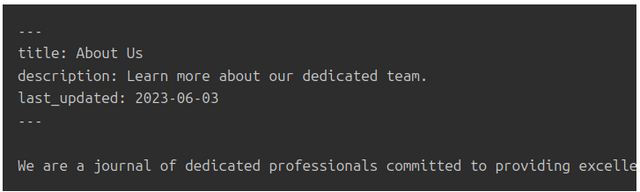
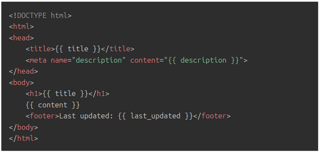
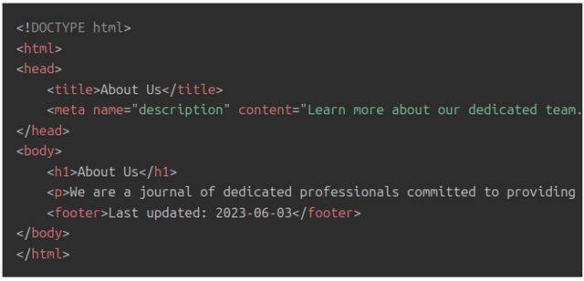
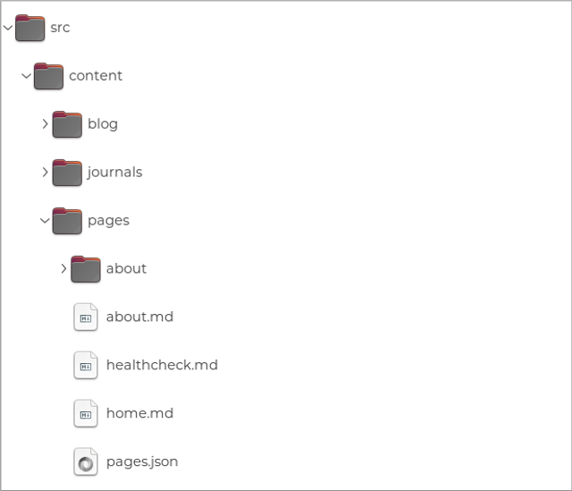
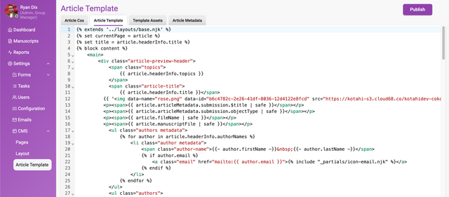
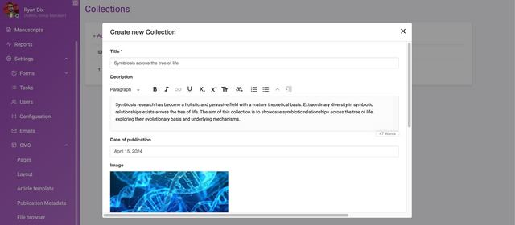
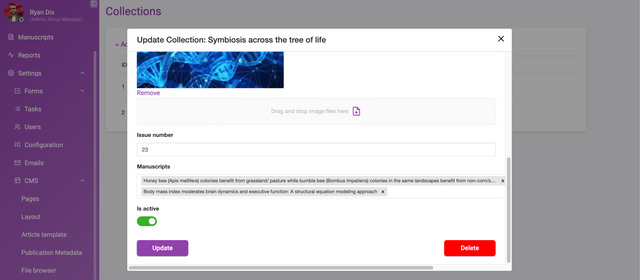

:::caution[Describes the earlier CMS]
This page is background on the **original Kotahi CMS**, which Coko built on [11ty](https://www.11ty.dev/). It is not documentation for **BATS CMS**, the CMS layer eLife Pathways is now developing. The architectural argument still applies; the specific implementation details do not.
:::

---

### In this section

### Learn more about the flexability of the Kotahi CMS.

The Kotahi CMS is an Agile Digital Content Platforms (or ACP\* for short), better known as 'static website generator' or 'headless CMS'. ACP’s are a game-changing solution. With an ACP, publishers define the logic and organisation of their content using plain text files. This paradigm escapes the 'hard-coded' and predefined logic imposed by a GUI, and allows for enormous flexibility for publishers wanting to tailor their content's structure, design, and functionality.

ACPs are not new in the web world. There are [plenty of these tools available](https://websitesetup.org/best-static-site-generators/?ref=robotscooking.com), the most popular of which are probably [11ty](https://www.11ty.dev/?ref=robotscooking.com), [Hugo](https://gohugo.io/?ref=robotscooking.com) and [Jekyll](https://jekyllrb.com/?ref=robotscooking.com).

ACPs are also not new in the publishing world, but usage in this domain is relatively rare. The rarity in publishing is due largely to legacy thinking and narratives from incumbent vendors that are heavily invested in their own technology. Consequently, most publishers think that a traditional CMS is the only way there is to present their content. Not so. The British Medical Journal [has used the ACP approach](https://www.thinslices.com/insights/reinventing-bmj.com-front-end-development?ref=robotscooking.com), [so has the Getty,](https://www.getty.edu/publications/digital/digitalpubs.html?ref=robotscooking.com) and you can also have a look at a [recent work by the Louvre](https://livres.louvre.fr/vandyck/?ref=robotscooking.com) made by Coko's ACP - FLAX (built into Kotahi). The scope illustrated by these projects, built by prestigious organizations, should tell you that the ACP approach is mature and mission-ready, as well as giving you some idea of the flexibility of content presentation that can be achieved.

\**Agile Digital Content Platform is a term used in this article for the purpose of better explaining this technical category to publishers. Many thanks to* [*Christian Kohl*](https://kohl.consulting/?ref=robotscooking.com) *for the name.*

## How it works

As an example, let's look at the Kotahi CMS developed by Coko for publishing use cases, built on top of 11ty (an approach [also adopted by the Getty](https://github.com/thegetty/quire/?ref=robotscooking.com)).

With the Kotahi CMS you edit text files that allow you to define three principle items - your data, your content, and your layout. There is more to it than this, but this idea is central to the design.

By way of example, let's consider creating an 'About' page for a journal. This process involves creating a simple text file as follows:

Let's dig into a brief, lightly technical, explanation. In the file above, the section between the `---` lines is known as the front matter. It defines variables (`title`, `description`, and `last_updated`). The content following the front matter is the content of your 'About Us' page.

Alongside the this you would also have a template file which defines a layout for your page:

In this template, the `{{ title }}`, `{{ description }}`, `{{ content }}` , and `{{ last_updated }}` parts are placeholders for your data as you already defined in the first file.

The Kotahi CMS interprets the 2 files, processes the variables, applies the templates, and generates static HTML files (HTML files on a server).

For our 'About Us' page, the output would be:

Your users would then see the above HTML rendered as page in their browser.

This is an obviously over-simplified example - there is enormous additional sophistication to be had via API integrations, calling external databases, plugins, Javascript, CSS etc - but it gets across the basic principles.

Core to the paradigm is the idea that you can provide any data you want, and surface it (and your content) in any kind of structure you want, as described using just text files.

Furthermore, because the entire system is defined simply by a bunch of text files, you can expose the directory tree to the user (which contains these files), giving the user full control over the way their content is presented.

## Advantages

The use of the Kotahi CMS instead of a traditional CMS provides many advantages:

1. **Independence from CMS constraints:** You're not tied to a particular CMS's complex, opinionated, codebase and predetermined constraints.
2. **Flexibility**: You have enormous flexibility to define the structure, design, and behavior of your publishing front end.
3. **Ease of Use:** Even with its high customisability, only a minimal amount of technical knowledge is required to build your content portal using this approach.
4. **Lightweight and Efficient content delivery**: ACPs generate static HTML files, leading to fast-loading pages and enhanced website performance. This is especially beneficial for users with slow internet connections or when your site experiences high traffic. This is also incredibly cheap when it comes to hosting costs as opposed to the hosting costs of a heavy duty CMS.

### Publisher autonomy

One further, major, advantage of this approach is that it liberates publishers from dependency on third-party software vendors for altering the CMS's internal logic. Traditionally, such alterations can be costly and time-consuming, leaving publishers at the mercy of software vendors. Particularly with proprietary software vendors, publishers have limited options but to request or pay for changes. Even when successful, the process of incorporating those changes is often protracted, as the vendor has to modify their code base's internal logic to accommodate the publisher's requirements.

In contrast,the Kotahi CMS allows publishers to collaborate with any technician - be it an in-house staff member or a local web developer to make these changes by simply editing text files. The required skill set falls within the web development realm, which is a more accessible and cost-effective field compared to traditional programming.

In essence, this approach provides publishers with an escape route from vendor lock-in, granting you greater autonomy and flexibility in managing and customising your content.

### Getting Stuck In

#### Article template

You can access the article CSS and template from the CMS>Article Template page.

#### Publication metadata

The publication metadata page displays all of the data captured in the Configuration>General>Group Identity section. With a ‘copy’ action easily copy/paste the handlebar variable to insert into the article template.

### File browser

As described above, the **exposed CMS directory tree** can be used to edit website page layouts, organization and display of article pages Flax. Add, edit and/or delete files and click publish to see the results in Flax. Some basic coding skills will be required to use this feature to its full potential.

### Collections

Add a 'Collection' and attribute related manuscripts to a collection. A collection can be used to capture publication 'Issue' data, for example.

The relationship between an article and a collection is not saved against the object data profile in the database. This feature is designed to display a collection of articles in Flax.

To take advanced CMS use further, contact the eLife Pathways team at [pathways@elifesciences.org](mailto:pathways@elifesciences.org).
