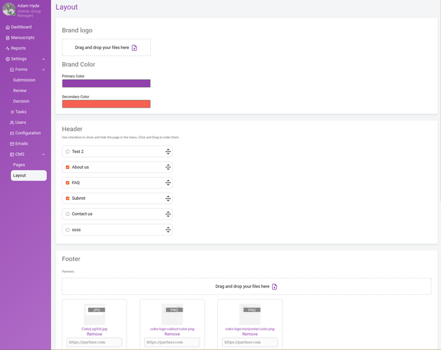
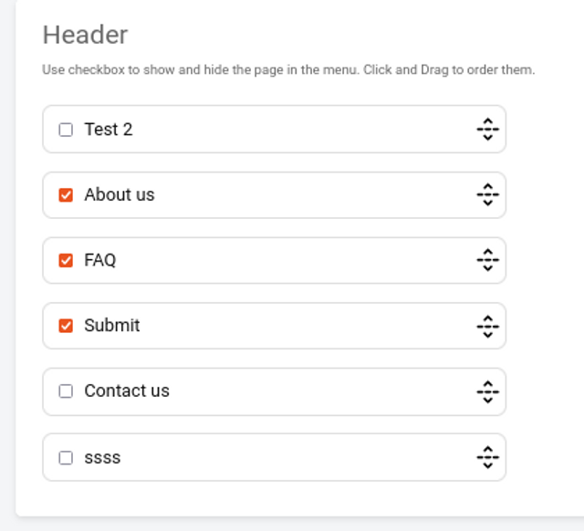
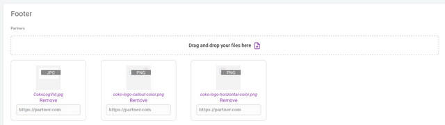
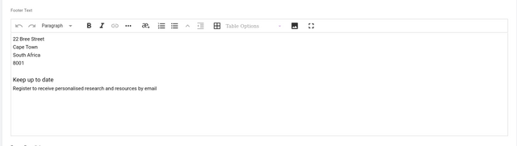
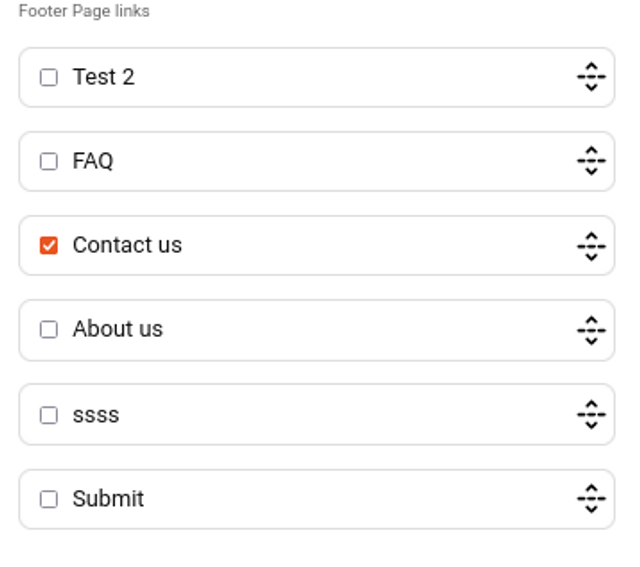

*Everything you need to know about the Kotahi headless CMS.*

Kotahi offers configurable publication options, including an internal CMS. Content can be published to the CMS, external endpoints, or both.

The CMS interface is provided for creating simpler publishing sites easily. You can locate the controls under Settings→CMS. If you choose the first of the items (‘Pages’) below the CMS selector, you will see the following.

Create new pages here and edit them with the editor provided.

To add a new page, click the ‘+’ icon. The page won’t be added to the publishing site until you include it in the menu and choose to publish it. You can publish pages by clicking on the **Publish** action.

You can fill out the new page title, the ‘stub’ (effectively the URL the page will appear on), and then add the initial content. The editor also supports image insertion.

## Layout

Layout of the page is accessed by clicking ‘Layout’ in the CMS menu.

Here you have some basic settings for the brand, uploading a logo, and selecting a primary and secondary color.

## Header

In the Header section, you can control the menu. The header section appears on every page. Pages ordered top to bottom are displayed from left to right as links in the header. Only selected pages are displayed when published.

Pages selected to appear in the header section on the publishing site (Flax).

View of published header page links on the publishing site (Flax).

## Footer

In the following options, you can configure what appears in the footer, starting with partner logos and associated website link. Footers are displayed on all pages.

Next you can set the footer text.

Lastly you can include links to additional pages in the footer (possibly items not in the topmost menu).

When you press ‘Publish’, the updated settings will be pushed to your publishing site.

## Status

This option allows you to hide your publishing endpoint from the web. Your publishing website will only be visible to those who have access to the ‘Draft’ link.

:::note[Screenshot being refreshed]
This screen is being re-captured against the current Kotahi release. Until then, here is what it shows.

**The screen shows:** CMS Layout page with the 'Status' panel highlighted: a ticked 'Draft' checkbox, the note 'Your publishing website will only be visible to those who have access to the Draft link', and the draft URL beneath.
:::

