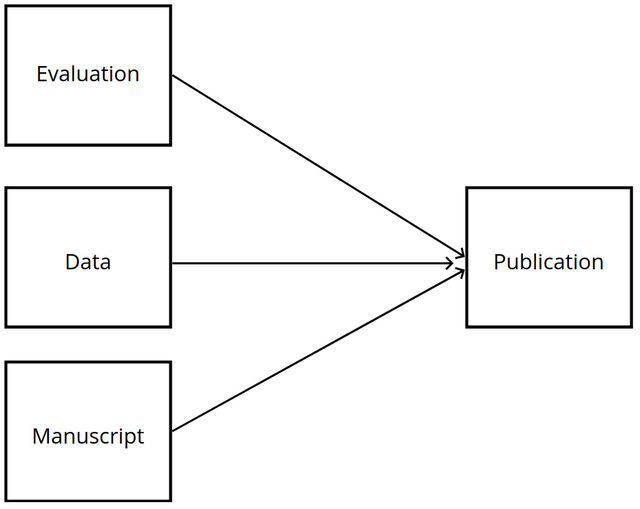

Kotahi is highly configurable and can publish a wide variety of research outputs. Here are some of the main options:

## Types of content

- **Evaluations** - Review content and decision summaries from the peer review process. This could include full verbatim reviews or edited excerpts.
- **Data** - Datasets, metadata, code, multimedia, and other supplementary files.
- **Manuscripts** - Preprints, journal articles, conference papers, micropublications, and other scholarly documents.

## Publishing destinations

- **Your own public website** - Kotahi can build and host the site your readers see, and it is customisable to fit your needs. (Kotahi calls this the CMS.)
- **External endpoints** - Kotahi can publish to any external endpoint or system provided it can receive the data. This includes institutional repositories, preprint servers, journals, archives, social media, and more.
- **Multiple targets** - Content can be published to your own public website, to external endpoints, or to both at once.

## Configuration Options

Kotahi allows flexible configuration of publishing in various ways:

- publish any combination of evaluations, data, and manuscripts or none at all
- publish to single or multiple endpoints
- customise metadata, identifiers, licenses, formatting, layouts, and more

In summary, Kotahi enables publishing virtually any scholarly content anywhere through a highly configurable system.

## Video: Kotahi Designer Discussing What Kotahi Can Publish
