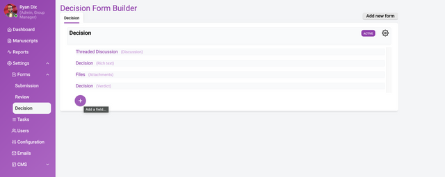

---

### In this section

### Build a powerful form for decisions and evaluation.

The decision/evaluation form builder is powerful because it enables detailed customization of the decision-making process. By allowing the addition of custom fields and metadata, it goes beyond basic accept/reject choices to capture nuanced evaluation criteria.

The decision/evaluation form builder allows customisation of the controls on the Decision tab in the manuscript review interface. This enables capturing nuanced details of your evaluation workflows.

The form builder provides advantages such as:

- adding custom fields related to the decision itself, like evaluation criteria ratings, rather than just a basic accept/reject choice
- incorporating additional metadata fields beyond the core decision, such as status markers, that relate to workflow steps
- guiding editors/curators to provide structured inputs through smart form design, rather than just freeform comments
- collecting consistently structured data across all decisions for better reporting and analytics
- adapting the decision inputs over time by altering the form fields to fit evolving needs
- streamlining the decision process by focusing inputs on what's most relevant

The flexibility to customise the editor/reviewer decision form allows the creation of optimised workflows for evaluation. This moves beyond basic decisions to gather meaningful metadata that informs the publishing process.

To get started, choose Settings→Forms→Decision.

The above image shows a completed decision form. Building a decision form is essentially the same process as building a submission form (see documentation).

### Support for multiple decision forms

Currently, you can create multiple decision forms but only a single form can be selected for use. Only the **Active** form will be available to editors.

Furthermore, if your workflow supports a decision of ‘Accept’, ‘Revise’ and ‘Reject’ then select the Radio buttons **Data type**, set the **Field type** to ‘Verdict’ and configure the settings as follows;

- selecting ‘Accept’ will enable the ‘Publish’ action
- selecting ‘Revise’ will allow the author to submit a new version
- selecting ‘Reject’ will disable the ‘Publish’ action

You will need to set the **Field type** to ‘verdict’ to enable this functionality.

