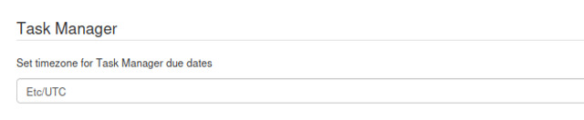

---

### In this section

### Configure Kotahi to meet your needs.

Kotahi has many configuration options to meet a diverse array of workflows and publishing models.

This page shows general settings for configuring many aspects of Kotahi. To access this page choose Settings→Configuration.

There is a lot here! Let’s go through the controls one by one, top to bottom. This will be a long story as there is some context that we need to give for some of the items. The page is grouped by functionality across the following tabs;

- General
- Workflow
- Production
- Integration and Publishing endpoints
- Notifications and E-mail

### General

#### Instance type

Kotahi can be configured to meet many types of workflows and use cases (see section titled ‘Pre-configured workflows’). What is also very powerful is that Kotahi comes with some preset configurations you can choose from. We call these ‘archetypes’. Typically you cannot change this setting for a group (tenant) in Kotahi once it has been set by the administrator. However, you can create as many groups as you like, each with its own archetype. Instance types are set by a developer via the system configuration (.env) file.

It is also possible to create a workflow and save it as a template but at this moment you will need a developer to do this for you.

Instance types at the moment include:

1. **journal** - a typical Journal workflow
2. **prc** - a PRC workflow
3. **preprint1** - submit, review and publish from a single form
4. **preprint2** - submit, review and publish from a single form, and import preprints

#### Group identity

Enables you to set basic branding for your group.

**Brand name** - this enables you to set the name of the group. The group name is displayed in a dropdown menu at login time for installations with multiple groups

**Title** - is the title of your publication

**Description** - a brief summary outlining the purpose of your publication

**ISSN** - is an 8-digit code used to identify newspapers, journals, magazines and periodicals of all kinds and on all media–print and electronic

**Contact** - contact details can be inserted as plain text

**Brand primary color** - used for the left hand menu, some buttons, and title texts

**Brand secondary color** - used for additional highlighting

**Logo** - the logo for the group login page

**Favicon** - icon displayed on your browser tab

### Workflow

#### Dashboard

In Kotahi, you can change the landing page for users as the first page they arrive at after they log in.

The Landing page settings allows you to choose from either the **Dashboard** or the **Manuscripts** page as the landing page. The Dashboard is probably the most common use case but in flatter hierarchies, the entire community may wish to have access to the manuscripts page. We have found this to be the case for small groups working together or some preprint review communities.

You can additionally choose which tabs are displayed on the Dashboard. Your choice here is also reflective of your use case. If you are a Journal group, then you probably want to select all three items. If you are a community that reviews preprints that are automatically ingested, you may wish to only display the ‘To Review’ item etc

### Manuscripts page

Here you have some great options for configuring the Manuscripts page.

1. **List columns to display on the Manuscripts page** - you can configure the columns displayed on the Manuscripts page. This is actually more powerful than you might think. It is possible, for example, to create a form element in the submission form builder for the selection of workflow status from a dropdown. This can then be displayed as a column on the Manuscripts page and effectively functions as a workflow tool. There are many other possibilities and experimentation is key. Columns are added using the comma-separated internal fieldname fields for each form element added in the submission form (you can hide these elements from submission and review forms if required via the form builder controls).
2. **Number of manuscripts listed per page on the Manucripts page** - this controls the number of items displayed as a list (pagination controls).
3. **Hour when manuscripts are imported daily (UTC)** - this is a setting for the AI importing of preprint metadata. Currently set up for the AI integration requires a developer but you can use these settings to control how it works once set up.
4. **Number of days a manuscript should remain in the Manuscripts page before being automatically archived** - if you are auto-ingesting manuscripts, you might get a lot of ingested items and not be able to get through them all in the time window you desire. This option gives you the ability to auto archive those ‘expired’ items if required.
5. **Import manuscripts from Semantic Scholar no older than ‘x’ number of days** - when auto-ingesting preprints via AI you can specify the maximum age of the preprint. This helps preprint review communities discover the latest preprint materials for review.
6. **'Add new submission' action visible on the Manuscripts page** - displays the button to start a manual submission from the Manuscripts page. This is useful for many use cases, it has been used to enable preprint review communities that have automated ingestion of preprints to also add an item manually.
7. **Display action to ‘Select’ manuscripts for review from the Manuscripts page -** ‘Select’ is a triaging feature, especially useful in conjunction with bulk imports. It changes the 'label' field to ‘Ready to evaluate’. Filtering and bulk deletion can be used in conjunction with these labels. It is also used for feeding AI selection criteria in some use cases.
8. **Import manuscripts manually using the 'Refresh' action** - this will put a ‘Refresh’ button on the Manuscripts page so you can manually start the auto ingestion process.

### Control panel

This setting group enables you to configure various items on the Control page.

1. **Display manuscript short ID** - each research object has a unique ID given to it by Kotahi. This is an ‘internal’ identifier largely just used so users can discuss or find the item easily. Checking this item will display the relevant manuscript ID on the Control Panel for each research object.
2. **Reviewers can see submitted reviews** - set if you wish reviewers to see each others’ reviews. If not checked, reviewers can see only their own review.
3. **Authors can see individual peer reviews** - if checked, authors can see the entire review for each reviewer.
4. **Allow authors to participate in proofreading rounds -** if checked, editors will be able to assign authors to a round of proofing.
5. **Editors can edit submitted reviews -** if checked, editors can edit submitted reviews from the Control panel>Reviews page.
6. **Control pages visible to editors** - you can hide various tabs if they are not relevant to your use case.

### Submission

There is one item - **Allow an author to submit a new version of their manuscript at any time**. This setting determines if an author/submitter needs to wait until the beginning of a new review round to submit a new version of their manuscript and metadata, or alternatively, if checked, the author can submit at any time (even mid-review). This has been used by preprint review communities where the review process (Kotahi) and submission system (a preprint server) are decoupled.

### Review page

This setting determines whether Reviewers can see the decision/evaluation information.

### Task manager

Here you can set the timezone for the date picker when setting tasks.

### Reports

Settings to show or hide the reports page from the menu.

### User management

One interesting user setting and a misplaced API key setting

**All users are assigned Group Manager and Admin roles** - essentially gives you a flat community hierarchy in which all users can access all pages in the menu and see all parts of the process.

## Production

Settings relevant to the Production page include controls to configure output when using the ‘Reference’ parser.

:::caution[Screenshot withheld pending re-capture]
A screenshot belongs here, but the archived capture contains personal data (names, email addresses or ORCID identifiers) belonging to real people and has not been published.

**What it showed:** 'Production' settings group with fields for 'Email to use for citation search', 'Number of results to return from citation search' set to 3, 'Select style formatting for citations' set to 'Chicago Manual of Style (CMOS)' and 'Select locale for citations' set to 'en-US'.

*Action needed: re-capture this screen using test data.*
:::

### Integrations and Publishing Endpoints

#### Semantic Scholar

A checkbox setting to enable/disable the import of preprints from [Semantic Scholar](https://www.semanticscholar.org/). Group Managers can select servers to import preprints/journals from. This feature is only implemented on the `prc` archetype. This is because import queries are most commonly associated with a publish, review and curate workflow, and an existing query will need to be in place to use this feature.

### Hypothesis

Settings related to some specific publishing endpoints. This may or may not be relevant to you. Essentially, if you are publishing preprint reviews to some external services the way in is via the hypothesis API.

:::caution[Screenshot withheld pending re-capture]
A screenshot belongs here, but the archived capture contains credentials (an API key, token or password) visible in plain text and has not been published.

**What it showed:** 'Publishing' section, 'Hypothesis' group, with a 'Hypothesis API key' field, a 'Hypothesis group id' field, and two unticked checkboxes: 'Apply Hypothesis tags in the submission form' and 'Reverse the order of Submission/Decision form fields published to Hypothesis'.

*Action needed: re-capture this screen using test data.*
:::

### Crossref

API information and controls for accessing Crossref.

:::caution[Screenshot withheld pending re-capture]
A screenshot belongs here, but the archived capture contains personal data (names, email addresses or ORCID identifiers) belonging to real people and has not been published.

**What it showed:** 'Crossref' settings group listing fields for journal name, abbreviated name, home page, Crossref username, password, registrant id, depositor name and depositor email, a publication type dropdown set to 'article', DOI prefix, published article location, a CC BY 4.0 licence URL, and a ticked 'Publish to Crossref sandbox' checkbox.

*Action needed: re-capture this screen using test data.*
:::

### Webhook

This section enables you to set a webhook for publishing to an external endpoint.

:::caution[Screenshot withheld pending re-capture]
A screenshot belongs here, but the archived capture contains credentials (an API key, token or password) visible in plain text and has not been published.

**What it showed:** 'Webhook' settings group with a 'Publishing webhook URL' pointing at a GitLab pipeline trigger endpoint, a 'Publishing webhook token' field, and 'Publishing webhook reference' set to 'main'.

*Action needed: re-capture this screen using test data.*
:::

**Publishing webhook URL** - the endpoint or target for the publishing action supplied as a URL

**Publishing webhook token** - the secret token used to authenticate the exchange

**Publishing webhook reference** - data sent to the target to know how to process the information

### Kotahi API tokens

Input a token to access the `unreviewedPreprints` API and no other queries.

### COAR Notify

Kotahi can receive messages from [COAR's Notify service](https://www.coar-repositories.org/notify/). Authors can submit a manuscript to a 3rd party server and request a review from a group in Kotahi. Selected server IP addresses can be inserted (as comma-separated variables) and whitelisted - Kotahi can only receive requests from servers that are whitelisted.

A request results in a manuscript being imported and displayed on the Manuscripts page. Manuscripts imported via COAR Notify are identifiable by the Notify logo in the title text.

:::caution[Screenshot withheld pending re-capture]
A screenshot belongs here, but the archived capture contains personal data (names, email addresses or ORCID identifiers) belonging to real people and has not been published.

**What it showed:** Manuscripts page listing five submissions in a table of Manuscript number, Title, Created, Updated, Status, Labels and Author columns, with a red arrow pointing to a manuscript carrying an 'UNSUBMITTED' status and a green 'COAR NOTIFY' label marking it as imported via COAR Notify.

*Action needed: re-capture this screen using test data.*
:::

### AI Design Studio

Utilize the studio to tweak page layouts, adjust image placements, manage widows and orphans, refine content with ease, or come up with completely new designs using the studio. Read more here; <https://www.robotscooking.com/redefining-document-design-unveiling-our-ai-powered-pdf-designer/>

Select an area (element) on the screen and insert a prompt into the AI chat editor and see the result! Add your OpenAI credentials on the Configuration>Integrations and Publishing Endpoints>OpenAI access key to activate the service.

## Task manager

Here you can set the timezone for the date picker when setting tasks.

## Notifications and E-mails

#### Emails

Configuration for the account information through which Kotahi will send emails. Currently, only Gmail is supported. These [instructions](https://support.google.com/accounts/answer/185833?hl=en) outline the correct Gmail password to use when configuring your account.

:::caution[Screenshot withheld pending re-capture]
A screenshot belongs here, but the archived capture contains credentials (an API key, token or password) visible in plain text and has not been published.

**What it showed:** 'Emails' settings section with three fields: 'Gmail email address', 'Gmail sender email address' and 'Gmail password' showing a masked value.

*Action needed: re-capture this screen using test data.*
:::

### Event notifications

Configuration options for sending email notifications. Each workflow type has supporting events, and the option to assign an email notification template.

1. **Reviewer rejects an invitation to review** - choose from the email templates for the email to be sent to the reviewer when they reject an invitation to review.
2. **Reviewer invitation** - set the email to be sent to the reviewer when they are invited to review.
3. **\*Submitted review** - set the email to be sent to the author when the editor has submitted a decision (accept, revise or reject) .
4. **\*Submitted manuscript** - choose the email to be sent to the submitter when a research object is submitted.
5. **Author proof assigned invitation** - choose this email sent to the author when invited to participate in a round of proofing.
6. **Author proof completed and submitted feedback** - choose this email if you wish an editor (editor role assigned) to receive a notification that the author has submitted proofing feedback.
7. **Unread discussion message** - choose the email to be read when messages are remaining to be read in a chat for all users.
8. **Immediate Notification for users @mentioned in a message** - choose the email template to be sent when a user is @ mentioned in the chat.

\*\*\*\*\*Currently, only available when using the journal workflow (instance archetype)
