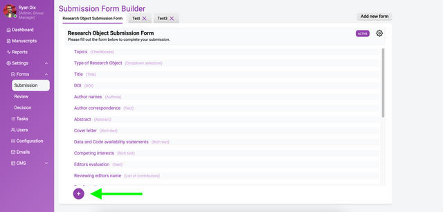
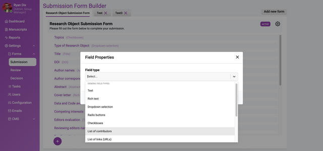
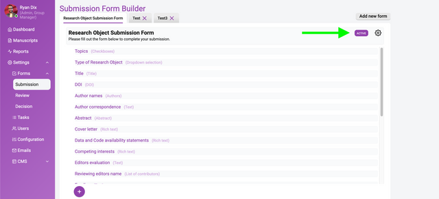

---

### In this section

### When a submission form is more than just a submission form

The submission form builder allows you to customise submission forms to fit your workflow needs, whether ingesting metadata (from, for example, preprint servers) or accepting direct submissions. While it may not seem powerful at first glance, the form builder is actually a versatile tool for configuring workflows.

The power of the form builder lies in its ability to streamline gathering the metadata you need from authors. Forms can be carefully designed to optimise completeness, accuracy and user experience during submissions. For instance, you can craft forms that ensure authors provide all required information in a clear and easy-to-follow format.

In addition, the form builder lets you create different forms to support various submission types and sources. A preprint ingestion form pulling metadata may need only a few key fields, while a direct author submission form for a micropublication format would require more granular data, and a full journal submission form would possibly require even more comprehensive details. The form logic allows you to customise for each workflow.

## The form builder and the data lifecycle

The Kotahi form builder enables innovative and powerful configuration options that can optimise the entire submission data lifecycle. The most powerful of these features include:

**Hide from reviewers** - Fields can be hidden from reviewers to control the metadata they see during the review process. This allows optimisation of the data profile for review.

**Hide from authors** - Form fields can also be hidden from submitting authors, for example, to capture data such as submission IDs without the author seeing it.

**Include at publication** - You can configure which fields are shared or published, and which remain internal only.

These form builder concepts allow granular control over the submission data workflow:

- what authors provide
- what reviewers see
- what is made public

With strategic use of these capabilities, you can streamline submissions for authors, tailor review data, and determine publishable metadata - all from one form.

This flexibility and customisability within a single form builder interface demonstrates why it is such a versatile submissions tool. You can optimise the entire submission data lifecycle.

## Getting started

To access the submission form builder, use the left menu → Settings → Forms. With some planning around your goals, the form builder allows you to build submission forms that truly enhance your workflows. It may not seem like a powerful tool initially, but the form builder offers extensive ability to optimise and streamline submissions.

The submission form builder provides all the necessary tools to create one or more submission forms. As mentioned above, Kotahi supports both automated creation of submissions (e.g. by ingesting preprint data using AI) and manual submission creation. Regardless of method, a submission form is required to hold metadata for research objects. For automated ingestion, fields can be auto-completed. For manual submission, authors/researchers must fill in the form data themselves.

In the image above you see a already-completed **Submission Form Builder**. On the left you see a list of form elements, on the right is the information about each element.

## Building a form

To start taking advantage of the submission form builder, I recommend beginning to build a form for your particular use case. A benefit of Kotahi is that you can easily do this in a new tenant without affecting any existing workflows you have already configured.

Some tips on getting started:

- make a plan of the key metadata fields and submission information you need authors to provide. Organise these into logical groups or sections.
- look at forms you currently use and think about areas that could be improved or streamlined in Kotahi.
- start by building a simple prototype form in a test tenant. You can iterate on it and add complexity over time.
- use Kotahi's flexible form widgets like descriptions and tooltips to optimise the author experience.
- don't worry about getting it perfect right away - tinker and tweak as you learn. The form builder makes it easy to enact changes.

The key is to dive in and start building a form for your workflow. Kotahi makes it low-risk to experiment and learn. Taking an iterative approach allows you to progressively improve the form to best fit your needs.

### Starting a new form

Let’s look at a new form and start breaking apart the interface. In a new form you will see the following.

Fill out the information on the right with placeholder or actual data (you can always change it later) and click ‘Update Form’.

Now click ‘+’, and you will see something like the following:

Select the **Field type** dropdown within this box enables you to choose what kind of form element you want. Currently, the choices are:

1. Text
2. Rich text
3. Dropdown selection
4. Radio buttons
5. Checkboxes
6. List of contributors
7. List of links (URLs)

Special fields types:

1. Title
2. Authors
3. Abstract
4. Attachment
5. Image attachment
6. DOI (suffix)
7. Custom status
8. Last edit date

When you choose one of these types then the page will display options for that element.

### Adding your first element

Starting with something simple, let’s choose to create a ‘Select’ element (dropdown menu).

Let’s look at each of these controls.

1. **Field type** - the type of element (‘Dropdown selection’ in this case).
2. **Field title** - the name of your field as it will appear in the rendered submission form.
3. **Name (internal field name)** - Name (internal field name). This metadata identifier is important for integrating the form data throughout your workflow. Use a format like ‘submission.yourFieldNameHere’. For example, ‘submission.preprintServer’ if collecting the preprint server name.

   The submission prefix carries the field through to other processes like generating JATS XML, publishing with the Kotahi CMS, or sending data to external systems.

   With some planning on field names, you can efficiently pull form data to where you need it later. See the documentation for more on how naming conventions enable workflows. The key is to think ahead on how you want to utilise the information collected in the form.
4. **Field placeholder** - prompt the user through the user of informative text that is visible in the form field text editor.
5. **Field description** - a full text explanation (if required). This description is displayed below the field when submitting.
6. **Field options** - allows additional configuration specific to each element type added to the form. For a Select input type, Field options let you build the list of items available for users to select from in the dropdown menu.

   To create the select options, first click ‘add another option’. You can now add one option per line in the format of ‘labelvalue’. The label is what users see in the dropdown, while the value is the internal metadata identifier that will be saved when an option is selected.

   For example you could have:

   Preprint Server A | preprintServerA

   Preprint Server B | preprintServerB

   This clearly labels the select options for users, while saving standardised values for the back end. You can also choose a colour for the section if required.

   Once the options are defined this way in Field options, they will populate the select dropdown. When users make a selection, the corresponding value will be captured as the submission data.

   Using Field options allows tailoring the Select input type with customised dropdowns that fit your metadata needs.
7. **Short title (optional — used in concise listings)**
8. **Validation options** - you can choose ‘Required’ if you wish this to be a required field.
9. **Hide from reviewers?** - here you can specify if the reviewers should this data on the Review page. In this way, you can use the form builder to determine the data profile of the research object which is visible for review.
10. **Hide from authors?** - you can decide if the field will be visible to the submitting author (if applicable).
11. **Include when sharing or publishing?** - Kotahi supports selective publishing and this option enables you to determine the data you will share at publish time.

Once you have completed all items press ‘Update Field’ and this will be recorded. You can now add more form elements and build up your submission form. See the documentation on each element.

### Support for multiple submission forms

Currently, you can create multiple submission forms but only a single form can be selected for use. Only the **Active** form will be available to authors.

