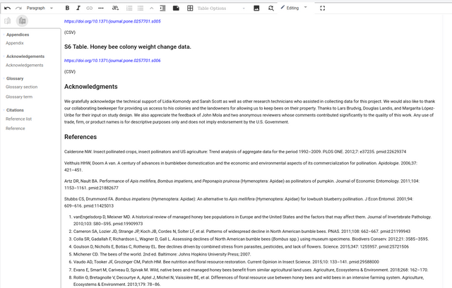
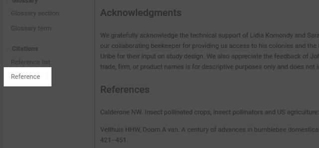
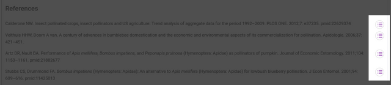
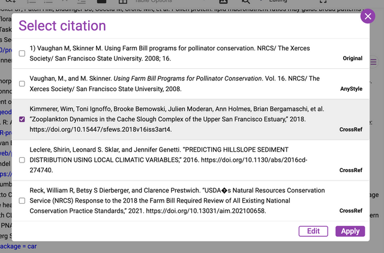
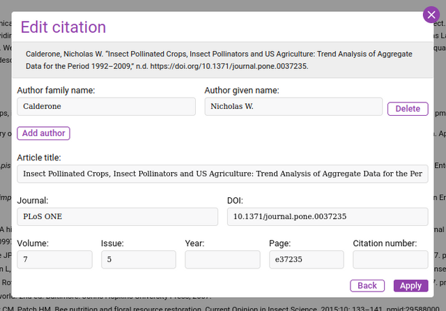

*Automated citation look ups.*

When using the production interface, the team can check the citations and improve them with the assistance of Kotahi’s automated citation tools.

To access these tools, view the research object in the production interface (linked from the Manuscripts page) and scroll down to the reference list.

On the left, you will see a reference tool:

Select an item in the references and then click on this reference tool. You will see a menu appear to the right of the reference.

Clicking on one of these icons will display an overlay.

Here you see a list of possible citations based on the information in the original citation. The recommended citations come from a variety of sources (more can be added). Native to Kotahi 2.0 are AnyStyle and Crossref sources.

You can now choose one of the citations displayed (these also conform to the citation format set in the Kotahi system settings).

You can also select one of these citations and click ‘edit’ and a further box will display for editing that selection.

This service relies on 3rd party APIs to generate results. These services may be disrupted from time to time. You may need to re-run imports if this service does not generate results as expected.

Settings to change the citation style and other related controls are located in the Configuration→Production section.

:::note[Screenshot being refreshed]
This screen is being re-captured against the current Kotahi release. Until then, here is what it shows.

**The screen shows:** Configuration 'Production' settings with 'Email to use for citation search', 'Number of results to return from citation search' set to 3, and the citation style dropdown open on 'American Psychological Association (APA)', 'Chicago Manual of Style (CMOS)' and 'Council of Science Editors (CSE)'.
:::

