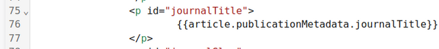

*Turning a manuscript into a typeset PDF, and changing how that PDF looks.*

Kotahi stores manuscripts as HTML. To produce a PDF it runs that HTML through
**[Paged.js](https://www.pagedjs.org/)**, an open-source pagination engine
developed by Coko, which applies your stylesheet and breaks the content into
pages.

With the default template you do not need to do anything — the PDF is produced
for you. Everything below is for changing how it looks.

## How a PDF is made

<svg viewBox="0 0 720 210" role="img" aria-labelledby="pdfflow-title pdfflow-desc" xmlns="http://www.w3.org/2000/svg" style="width:100%;height:auto;margin-block:1.5rem;">
  <title id="pdfflow-title">How Kotahi produces a PDF</title>
  <desc id="pdfflow-desc">An HTML template and a stylesheet are combined, passed to the Paged.js engine, and paginated into a finished PDF. You control the first stage; Kotahi handles the rest.</desc>
  <g fill="none" stroke="currentColor" stroke-width="1.5">
    <rect x="8" y="46" width="196" height="76" rx="8"/>
    <rect x="262" y="46" width="196" height="76" rx="8" fill="var(--sl-color-accent-low)"/>
    <rect x="516" y="46" width="196" height="76" rx="8"/>
    <path d="M212 84 H252 M244 78 L252 84 L244 90"/>
    <path d="M466 84 H506 M498 78 L506 84 L498 90"/>
  </g>
  <g fill="currentColor" font-size="16" text-anchor="middle" font-weight="600">
    <text x="106" y="82">HTML template</text>
    <text x="106" y="104">+ CSS</text>
    <text x="360" y="92">Paged.js</text>
    <text x="614" y="92">PDF</text>
  </g>
  <g fill="currentColor" font-size="13" text-anchor="middle">
    <text x="106" y="152">What you edit</text>
    <text x="360" y="152">Paginates and typesets</text>
    <text x="614" y="152">What readers get</text>
  </g>
</svg>

So customising a PDF comes down to two things: a **template** that says what
goes on the page and in what order, and a **stylesheet** that says how it
looks. The template can pull real values out of Kotahi — the title, the
authors, the DOI — so one template serves every manuscript.

Paged.js documents its own CSS rules in detail, and that documentation is
better than anything we could repeat here. Start with
[the Paged.js documentation](https://pagedjs.org/documentation/) once you know
where Kotahi keeps things.

## Where the controls are

Open a manuscript's **Production** page from the Manuscripts list. It has seven
tabs:

| Tab | What it is for |
| --- | --- |
| **Editor** | Writing and structuring the article itself, managing images, citations and JATS XML |
| **History** | Previous versions of the manuscript |
| **PDF template** | The HTML template that lays out the PDF |
| **PDF CSS** | The stylesheet applied when the PDF is generated |
| **PDF assets** | Logos, images, fonts and scripts the template can use |
| **PDF metadata** | The list of values you can pull in from Kotahi, with the code to paste |
| **Ai Design Studio (Beta)** | Changing the design by describing what you want |

:::note[Only Word files open in the editor]
The submission screen accepts pdf, epub, zip, docx and latex, but only **docx**
is converted into editable content — Kotahi parses it with XSweet, and it is
that converted text you see on the **Manuscript text** and **Editor** tabs. The
other types are stored rather than converted. Where the group's submission form
has an **Attached manuscript** field, editors and reviewers can download the
original file from there.
:::

## Getting a copy of the file

The Production page has a **Download** control, but it appears only when there
is something to download. It is rendered when the manuscript has manuscript
text — so a submission with no uploaded file, or one whose authors were never
given an editor to write in, shows no Download control at all.

This is worth knowing before you go looking for it: if it is not there, the
likeliest reason is that the manuscript in front of you is empty.

## The template

**PDF template** holds the HTML. Kotahi ships a working default, and reading it
is the fastest way to understand the conventions — it is a complete, functioning
example rather than a skeleton.

The templating language is **[Nunjucks](https://mozilla.github.io/nunjucks/)**,
which adds variables, loops and conditions to ordinary HTML.

**The head** works as it would on any web page: the `lang` attribute drives
hyphenation, and links to custom fonts or stylesheets go here. Anything you
link must exist in **PDF assets** first.

Scripts are the exception. Because Paged.js runs on the server, `<script>` tags
in the head are not executed. To run your own JavaScript, upload it to **PDF
assets** instead — Kotahi picks up any `.js` file there when the PDF is
generated. Paged.js documents
[hooks and custom JavaScript](https://pagedjs.org/documentation/10-handlers-hooks-and-custom-javascript/)
for this.

**The body** is where the layout lives — a title page, the article, whatever
your design needs.

HTML and template variables sit side by side. In this example an ordinary
paragraph carries an `id` for the CSS to target, and the shortcode between the
tags pulls the journal's name out of Kotahi:

The same pattern brings in the article body, and loops repeat a block for every
item in a list — every topic, every author.

**PDF metadata** lists everything available this way. Each field is shown
beside its shortcode with a copy icon, so you can paste it straight into the
template rather than typing it.

## Assets

**PDF assets** is where fonts, images and scripts are uploaded. Files can be
uploaded in batches, and each one has a copy link that produces the correct
line to paste into the template — a `<link>` for a font, an `` for an
image, and so on.

You do not need to preload images. Paged.js waits for them before generating
the PDF.

## CSS

**PDF CSS** holds the stylesheet. As with the template, Kotahi's default is the
best starting point: read it first, then use the Paged.js documentation for
anything it does not already show you. Page-level furniture such as page
numbers is controlled here too, not in the template.

## Ai Design Studio (Beta)

The Design Studio changes the PDF's design from a description rather than by
editing CSS — adjusting layout, image placement, or widows and orphans.

It needs an OpenAI key. Choose **Configuration** in the left menu, then the
**Integrations and Publishing Endpoints** tab, and add it under **AI Design
Studio & AI Assistant**.

Select an element in the content column on the left, and the PDF preview on the
right shows the result.

Then describe the change you want.

Undo and redo are available, and a chat history records what was asked for.
