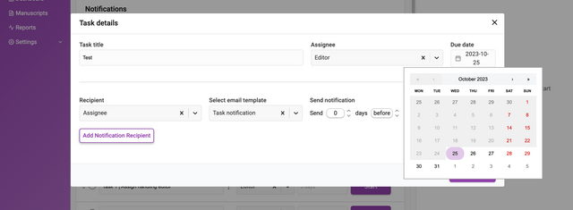
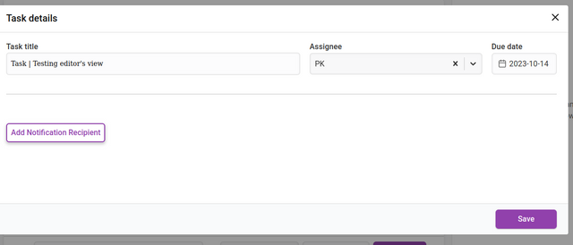
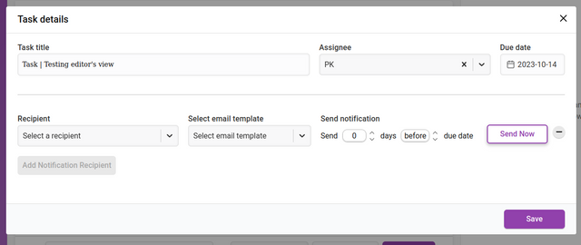
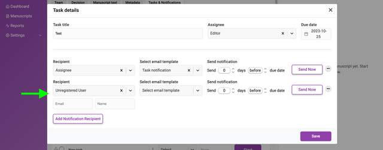
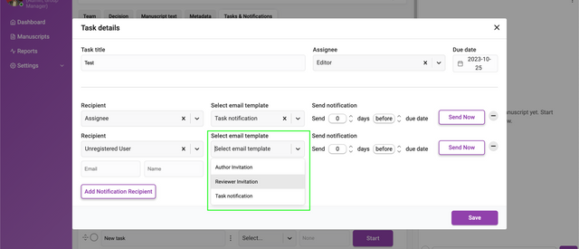
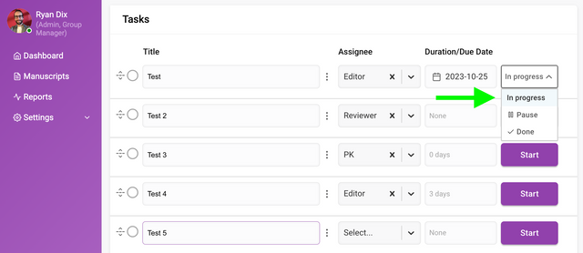

*Tasks help define, manage, track and optimize your workflow.*

The task configuration in Kotahi is an extremely powerful yet often underestimated feature. Defining tasks is not just a to-do list but rather it is where you can further optimise and customise your editorial and publishing workflows.

In Settings→Tasks you can set up a template for tasks that will be inherited by all research objects submitted.

Strategic task configuration unlocks benefits like:

- mapping out clear step-by-step workflows for different types of research objects
- automatically prompting editors/curators, reviewers and authors to complete important actions
- improving transparency by providing visibility into workflow status
- identifying workflow bottlenecks
- adapting workflows over time by iteratively improving task definitions
- standardising workflows across users by assigning the same task lists

With some upfront planning around aims, the flexible task engine enables enacting efficient, consistent, and customisable workflows in Kotahi. The tasks truly represent a powerful yet often overlooked opportunity for workflow optimisation.

## How to make task templates

The initial task list for the research object will be inherited from the task list set up in the system settings (see that section). It is also possible to add/delete/alter the inherited list to suit the needs of the specific research object.

Tasks can be created, edited, deleted, modified, started, and reordered from this interface.

**Starting a task** is done from the displayed ‘Start’ button.

**Adding tasks** is done via the ‘+’ button at the bottom of the task list.

**Adding a title** and **adding an assignee** can all be done via the input fields provided. The assignee dropdown displays a list of roles, and the full searchable list of users in the system for selection.

**Duration** (in days) can be managed via the duration field.

**Deleting** or **editing** of the tasks can be managed through the ellipses icon displayed between the task title and the assignee.

Deletion will ask you for a confirmation before completing.

When editing a task, the overlay for that task will appear.

Duration can be changed from the **Due Date** item on the left. When clicked it will display a date picker where you set a due date.

Clicking **Add Notification Recipient** will display an interface for adding new recipients of notifications. You can add as many recipients as you like.

The input fields require a chosen recipient from the **Recipient** dropdown list. You can also add a recipient that is not registered in Kotahi by choosing ‘Unregistered user’ from the dropdown. This selection will display additional fields for the email address and name of the recipient.

You can also **Select an email template** to be sent to each recipient.

Next set when the notification is sent out. The notification can be sent at a time of your choosing (including ‘now’) relative to the due date of the task. The **Send notification** fields allow you to choose a time before or after the due date by the number of days you require.

Email notifications are only sent when a task status is **I\*\*\*\*n progress**. To enable a task, click on the **Start** action. A task that is ‘Paused’ or marked as ‘Done’ will suppress scheduled email notifications from being sent. Notifications can still be manually using the ‘Send Now’ from the overlay.

## Special actions

We are adding further controls to the task manager as we believe it has enormous potential. Two important actions already possible from the task manager are inviting authors and inviting reviewers. You can action these from the notification controls. Inviting reviewers will add the reviewer invitation to the research objects reviewer list (accessible from the **Control** page). Inviting authors is for inviting an author to join a submission if that submission was automatically ingested (useful for some preprint review workflows).

The ‘Task notification’ email template contains a hyperlink that will direct the user to the manuscript task list. This can be particularly useful for editors who wish to be reminded of upcoming task deadlines.
