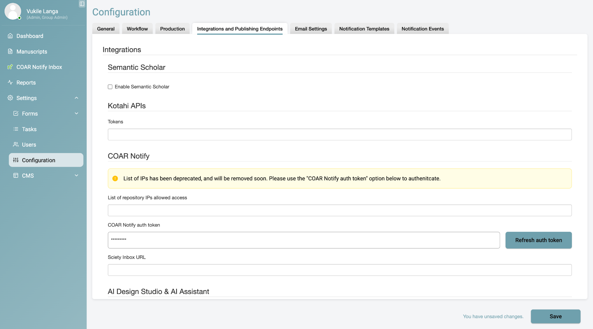
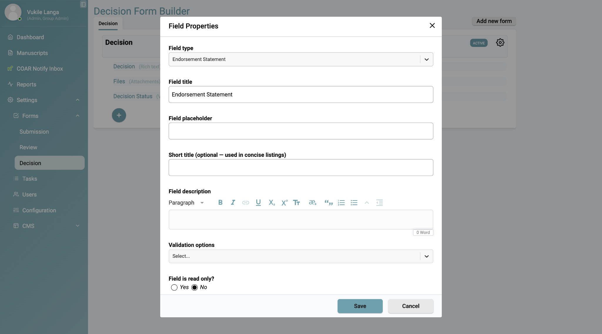
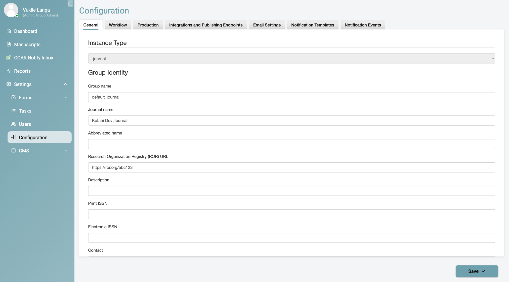

[COAR Notify](https://coar-repositories.org/tools-and-resources/notify/) is a
protocol for bidirectional communication between scholarly repositories and
review platforms. With it enabled, external services can send **Offers to
Review** straight into your Kotahi inbox, and Kotahi can respond with status
notifications including endorsements and review relationships.

This page covers turning it on and configuring it. For day-to-day use, see
[Using COAR Notify](/integrations/coar-notify-using/).

## Before you start

You will need:

- **Admin-level access** to your Kotahi instance
- Access to the **Integrations and Publishing Endpoints** section of settings
- Your **server URL** and **group name**, which together form your inbox
  endpoint: `https://<serverUrl>/api/coar/inbox/<groupName>`

## Step 1 — Enable COAR Notify in workflow settings

COAR Notify is hidden by default and must be enabled by an administrator before
anyone can access it.

1. Log in to Kotahi and select your group.
2. Go to **Configuration**, then the **Workflow** tab.
3. Scroll to **Control panel**.
4. Find **COAR Notify Metadata** and enable it.
5. Click **Save**.


Once enabled, two things become visible:

| Feature | Visible to |
| --- | --- |
| COAR Notify Inbox | Admin roles only |
| COAR Notify Metadata tab | Admin and Editor roles |

## Step 2 — Set up OAuth authentication

COAR Notify uses OAuth token-based authentication. You must generate and apply
a bearer token before any API communication will succeed.

1. Go to **Configuration**, then the **Integrations and Publishing Endpoints**
   tab.
2. Click **Refresh auth token** to generate a new token.
3. Click **Save**. Kotahi generates and displays your bearer token.
4. Copy the token and store it somewhere secure — you will need it for API
   requests.
5. Apply it in your API calls as an `Authorization` header:

```http
Authorization: Bearer <your-token>
```



:::caution[Keep the bearer token secret]
Do not share the token or commit it to version control. If you think it has
been exposed, return to this screen and refresh it immediately — refreshing
invalidates the old token.
:::

## Step 3 — Share your integration endpoint

External services send COAR Notify requests to your Kotahi API endpoint, which
is composed as:

```
[server URL] + [API path] + [group name]
```

So the full form is:

```
https://<serverUrl>/api/coar/inbox/<groupName>
```

Substitute your own server URL and Kotahi group name, then share the result
with the repository or service that will be sending you requests.

## Step 4 — Configure endorsement statements (optional)

Endorsement statements let Kotahi formally announce review relationships to
authors over COAR Notify. This is configured separately, in your decision form.

1. Go to the **Decision** sub-menu and click **+**.
2. Add a new field of type **Endorsement Statement**.
3. Save the configuration.



The endorsement statement field then appears in the relevant decision forms,
and the corresponding COAR Notify announcements fire when a decision is
recorded.

## Step 5 — Configure actor information

Kotahi uses the handling editor's ORCID details for most COAR Notify actor
information. Where it cannot determine the actor, it falls back to default
values, which you set here.

1. Go to **Group Identity Settings**.
2. Enter your **ROR identifier**.
3. Enter your **journal title**.
4. Save the configuration.



If group identity settings are left unconfigured, Kotahi defaults to the
handling editor's identity, or to anonymous identifiers where it has to.

## Getting help

Email the eLife Pathways team at
**[pathways@elifesciences.org](mailto:pathways@elifesciences.org)**.

:::note[Documentation accuracy — two things to check]
1. **Step 1 may be describing the wrong control.** In the screenshot above,
   "COAR Notify Metadata" appears as an item under *Control pages visible to
   editors*, which governs tab visibility. The instruction reads as though
   there is a separate top-level enable toggle. Someone with an instance to
   hand should confirm which control actually gates the feature.
2. **The screenshot shows a post-enable state.** The sidebar already contains
   *COAR Notify Inbox*, so COAR Notify was already on when the capture was
   taken. It cannot show what an administrator sees *before* enabling.
:::
