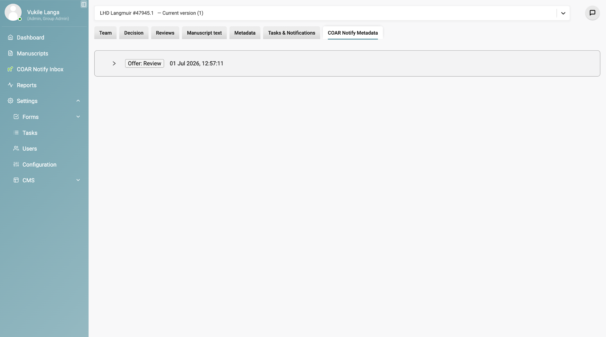

Once COAR Notify is
[enabled and configured](/integrations/coar-notify-enabling/), it adds two
places to look and a handful of workflow behaviours.

## The COAR Notify inbox

The inbox is available to **Admin roles only** and tracks all COAR Notify
traffic in and out of Kotahi. From it you can:

- see a full log of incoming and outgoing messages
- view the raw payload for any individual request
- search for requests by DOI
- jump straight to a manuscript's control page
- edit and resend a payload where a request contained an error

Message types you will see include **Offer: Review** for incoming offers,
**Announce: Review** for outgoing announcements, **Undo** for withdrawn
requests, and **Flag: Unprocessable Notification** where something could not be
processed.

## The COAR Notify metadata tab

This tab is visible to **Admin and Editor** roles and lives inside an
individual manuscript record. It shows that manuscript's full history within
the COAR Notify system: every request, response and status change relevant to
it.

## Spotting COAR Notify submissions

Manuscripts that arrived via COAR Notify can be told apart from direct
submissions and bioRxiv imports in two ways:

- an **indicator symbol** on the manuscripts list page
- the **source in the payload**, viewable in the inbox

To make the indicator more prominent, change the component display setting from
`submission.$title` to `titleAndAbstract`.

## Offers to review

An **Offer to Review** is triggered externally, when a repository or preprint
server sends a COAR Notify request to your inbox endpoint. It appears in the
inbox for review.

When an editor is assigned to the manuscript, Kotahi automatically sends a
**Tentative Accept** notification back to the originating service. You do not
need to send that yourself.

## Undoing a request

If an Offer to Review was sent in error or is no longer valid, the sender can
submit an **Undo** request. Once processed:

- the manuscript moves to an archived list
- no further editorial actions can be taken on it
- an **Unprocessable Notification** is sent if the undo itself fails

## Revisions and duplicate DOIs

Kotahi currently **rejects submissions that share a DOI with an existing
record**. If a revised manuscript arrives with the same DOI as one already in
the system, you must create a new manuscript record rather than reusing the
existing one.

:::note[In development]
Proper manuscript versioning, with DOI linking between versions, is planned but
not yet scheduled. Until then, expect revisions to appear as separate records.
:::

## Handling errors

When a COAR Notify request fails, the feedback appears in the inbox. Common
causes:

- **missing required properties** in the payload
- **unauthorised requests** — an invalid or expired bearer token
- **an incorrect or unrecognised DOI**

To resolve one:

1. Find the failed request in the COAR Notify inbox.
2. Click to view the raw payload and identify the problem.
3. Edit the payload directly in the interface.
4. Resend the corrected notification.

## Current limitations

Known gaps, as of the July 2026 release:

| Area | Current state |
| --- | --- |
| Manuscript versioning | Versions sharing a DOI are not linked. On the roadmap, not yet scheduled. |
| UI alignment | Visual formatting of COAR Notify notification tags is still being refined. |
| Centralised monitoring | Functional, but does not yet log all planned fields — sender IP address among them. |

## Further reading

The protocol itself is documented by COAR at
**[coar-repositories.org/tools-and-resources/notify](https://coar-repositories.org/tools-and-resources/notify/)**.

## Getting help

Email the eLife Pathways team at
**[pathways@elifesciences.org](mailto:pathways@elifesciences.org)**.

:::note[Source document had two images swapped]
In the original PDF, the screenshot captioned as the inbox message list was
actually the error dialog, and the same error dialog was used again for the
error-handling section. The images have been reassigned to the sections they
actually depict, so both are now correct here.

One state still is not illustrated: viewing a raw payload for a request that
has **not** errored. The only payload capture available shows the error
variant. Worth a screenshot when someone next has an instance open.
:::
