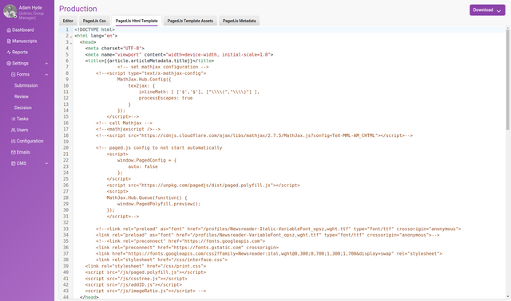
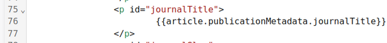
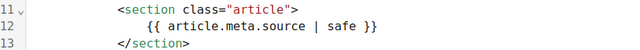
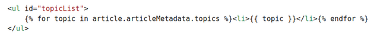
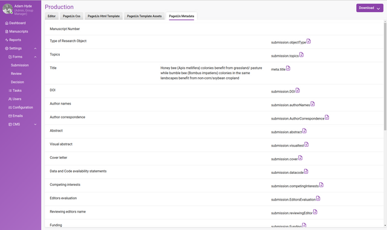
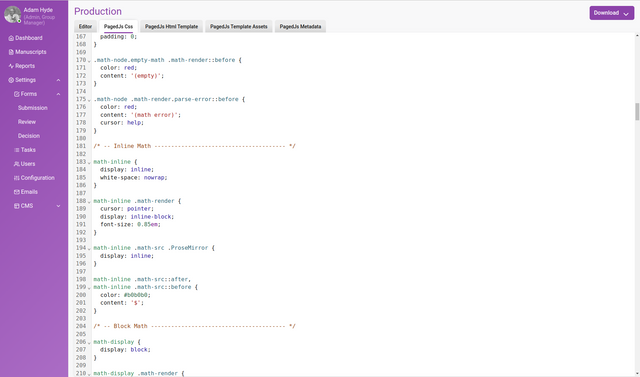
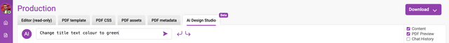

---

### In this section

### Kotahi’s Innovative Approach to PDF. Including the new AI Design Studio.

Kotahi introduces a streamlined PDF production interface. With the default template, generating a polished PDF is as easy as a single click.

Kotahi also provides sophisticated customization tools for full control over the final PDF's look and feel. While primarily designed for publishing journal articles on the Kotahi CMS, the PDF can be hosted anywhere and the tools enable creating PDFs out of any combination of data, manuscripts, and evaluations.

This chapter explains how to leverage Kotahi's flexibility. It covers creating article PDFs step-by-step, from simple defaults to elaborate custom designs. Whether you need a basic article download or a complex tailored layout, Kotahi equips you to produce the PDF you envision.

## PagedJS

To understand Kotahi’s PDF production, it helps to know the underlying process. Articles are stored internally as HTML. To generate print-quality PDFs, Kotahi utilizes the open-source Paged.js engine (<https://www.pagedjs.org/>).

Developed by Coko for typographic control, Paged.js applies CSS styling and typesetting logic to paginate HTML content into PDF.

Kotahi PDF customization boils down to creating a HTML template and adjusting CSS styling rules. This enables independent and granular control over page dimensions, typography, colors, layout elements, and more prior to output. From a high level the process looks like this:

For full docmentation on the CSS rules that can be used to control the struture, look, and feel of the PDF using PagedJS please see the PagedJS documentation (<https://pagedjs.org/documentation/>).

## The Production Interface Tabs

You will see several tabs in the Production Interface (Kotahi 2.2 and later).

Kotahi’s PDF production interface contains several tabs:

**Editor** - The content editing environment for writing, structuring articles, managing images/media, enabling citations, and producing JATS XML.

**PagedJS CSS** - A dedicated CSS editor for fine-tuning visual styles like colors, fonts, alignments applied to the PDF content. The CSS also controls PDF page elements like page numbers etc.

**PagedJS HTML Template** - The template used for creating the HTML that will in turn be used by PagedJS to create PDF.

**PagedJS Template Assets** - Storage for all supporting assets like logos, images, and custom fonts to include in the PDF.

**PagedJS Metadata** - Shortcodes referencing data from the Kotahi system to dynamically pull into the PDF, like publication date, ethical declarations, authors, publisher etc.

Together these tools provide end-to-end control over the PDF output - from editing content with supporting assets, to structuring the document format, styling and customizing the visual presentation as PDF, and injecting dynamic article data elements.

To effectively leverage Kotahi's PDF engine, four key points to understand are:

1. The **PagedJS HTML Template** acts as the overarching blueprint dictating the structure and arrangement of all PDF content.
2. The template can mix static content with variables pulling dynamic article data from Kotahi's database through **PagedJS Metadata** shortcodes.
3. The linked **PagedJS CSS** provides precise control over styling and typographic treatments applied to template contents when generating the PDF.
4. Together, the HTML template handles content while the CSS controls visual presentation and style - in combination they allow crafting polished, customizable PDF layouts.

With this foundation established, the production flow is:

A) Arrange content blocks in the HTML template

B) Use PagedJS Metadata to inject dynamic article data

C) Style and refine visual design through cascading CSS

D) Export to PDF

If you understand these key points and high level process, you understand a lot.

## Making a Template

Templates can be made using the **PagedJS HTML Template** tab.

Kotahi includes a default **PagedJS HTML Template** demonstrating best practices for structuring PDF-destined content. When first accessing the template editor, this pre-loaded template serves both as a starting point for modification and a functional example for dissecting key features.

As the foundation driving PDF rendering, scrutinizing the default template lends vital insight into creating optimized templates from scratch. It illustrates conventions for employing:

- Metadata shortcodes to incorporate dynamic article data
- Modular components to manage distinct content blocks
- Structural HTML elements like headers, paragraphs, and divisions
- Styles for custom CSS treatments

Lets walk through an example template from head to toe and point out some of the important features as we go.

The templating language used in Kotahi is [Nunjucks](https://mozilla.github.io/nunjucks/). It’s easy to understand and edit, and yet, it’s still capable of complex manipulations, loops and filters to generate the content in every way needed.

### Head

The head of template contains information that is typical for a HTML page. The lang property will define the language used for typesetting engines hyphenation and character encoding.

**Loading Scripts**

Since we’re using Paged.js server side rendering, the existing scripts in the head tag will not be used. Instead, to load custom Paged.js scripts in Kotahi, you need to add them as external assets. Kotahi will try to use any file with a .js extension from the asset panel. Those script will then run when you’ll download the pdf.

You can experiment with all kinds of scripts (for example a Q-code generator) and we recommend reading the PagedJS documentation on how to do this. You can find everything about hooks and custom javascript for paged.js here: <https://pagedjs.org/documentation/10-handlers-hooks-and-custom-javascript/>

**Linking External Assets**

The head is the place to add link to custom fonts that exist in the Template Asset tab, or link to external stylesheets or custom fonts to make them available when the PDF generation will happen. There is no need to preload any images in the HTML, as [Paged.js](https://pagedjs.org/) will generate the PDF only after loading all images.

Careful script and link management in the head are vital first steps in crafting fully-functional templates.

### Body

The body information is where the content is layed out in the template:

You can see here how HTML elements and template variables are combined to lay the content out in the template. You can see this clearly in this simple example:

In this example you can see a paragraph tag with an **id** used by the CSS for styling. Inbetween the P tags we see a template shortcode which draws in data from the Kotahi database. In this case, the variable is pulling in the name of the Journal that publishes the article.

In the following example you can see how the source of the article itself is brought into the template:

There is also conditional logic in some of the lines using variables:

There is also conditional logic in some of the lines using variables:

The list of items on the left of the page is the actual shortcode you need to use. Clicking the page icon wiht the ‘+’ will copy the shortcode to the clipboard that you can copy and paste into the template.

## PagedJS Template Assets

You can upload assets you wish to use in the template via the assets tab.

In this tab you can upload any kind of assets but the three main types are:

1. **Scripts** - JavaScripts that will be used to render content or for scripts that hook into the PagedJS (to extend PagedJS functionality, see the PagedJS documentation for more information about this — <https://pagedjs.org/documentation/10-handlers-hooks-and-custom-javascript/>)
2. **Images** - images such as logos or partner logos etc can be uploaded to the asset interface.
3. **Fonts** - any fonts you wish to be used for rendering the PDF should be uploaded here.

Batch uploading of assets is possible.

All items listed can be easily included into the template by clicking on the appropriate ‘Copy’ link. This will copy to the clipboard the appropriate information to paste into the template.

## PagedJS CSS

The PagedJS CSS tab is where you can edit the CSS:

To know how to write this CSS first read the defaults to get an understanding and then also consult the PagedJS documentation.

## AI Design Studio

With a focus on PDF production, utilize the studio to tweak page layouts, adjust image placements, manage widows and orphans, refine content with ease, or come up with completely new designs using the studio. Read more here; <https://www.robotscooking.com/redefining-document-design-unveiling-our-ai-powered-pdf-designer/>

Add your OpenAI credentials on the Configuration>Integrations and Publishing Endpoints>OpenAI access key to activate the service.

You also have controls to display content (left column), PDF preview (right column).

In the lefthand column; select an area (element) by clicking on the screen.

Insert a prompt into the AI chat editor...

and see the result.

