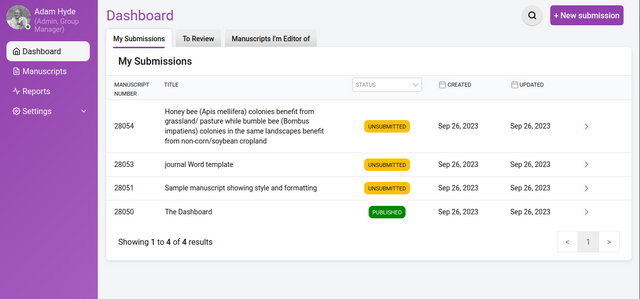
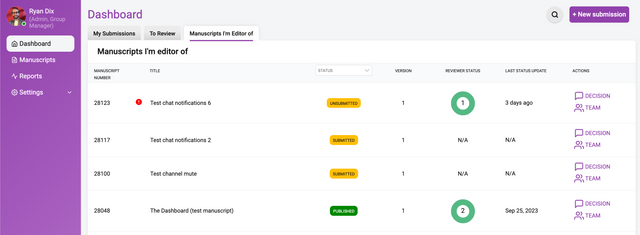

The Dashboard shows you the research objects you are assigned to.

Here you can see all the research objects for each role within the group. The above example displays 3 tabs:

1. **My Submissions** - the list of research objects submitted or created within the group
2. **To Review** - the list of research objects to review
3. **Manuscripts I’m an editor of** - the list of research objects for which you are an editor / curator

Within each of those tabs there is a list which is different according to the tab selected:

## My Submissions

In the **My Submissions** tab (the tab displayed by default) the following columns are shown:

1. **Manuscript ID** - the unique identifier (created automatically by Kotahi) for each research object
2. **Title** - the title of the research object
3. **Status** - the status of the research object (see below)
4. **Created** - the date of creation/submission
5. **Updated** - the date when something was last changed

## To Review

In the **To Review** tab the following columns are shown:

1. **Manuscript ID** - the unique identifier (created automatically by Kotahi) for each research object
2. **Title** - the title of the research object
3. **Your Status** - the status of the invitation.

## Manuscripts I’m an editor of

In the **Manuscripts I’m an editor of** tab the following columns are shown:

1. **Manuscript ID** - the unique identifier (created automatically by Kotahi) for each research object
2. **Title** - the title of the research object
3. **Status** - the status of the research object (see below)
4. **Reviewer Status** - a graphical status display of the reviewer process
5. **Updated** - the date when something was last changed
6. **Updated** - the date when something was last changed
7. **Actions** - a link to the control panel and team pages for the research object
8. **Indicator** - an icon indicates an overdue task

## Sorting

All columns within each of the Dashboard tabs are sortable. To sort click on the name of the column you wish to sort by, to reverse sort click the same column name again.

## Filter

To filter the Status column, click the dropdown and select the state to be viewed e.g ‘Unsubmitted’. Sorting can be applied on a filtered view.
