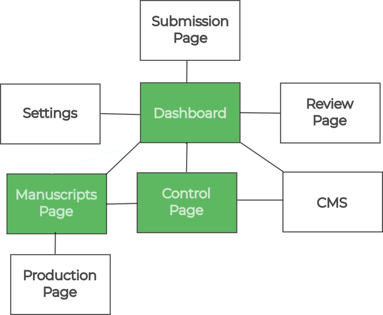

Kotahi has a number of screens or pages connected together that allow for the amazing versatility of workflows. From a very high level, the interconnected ‘spaces’ or pages look like the following.

Each of these is convered in detail in this documentation. Here is a brief overview:

1. **Dashboard** - the starting page for most users where new submissions are created and associated research objects accessed.
2. **Submission page** - where metadata and files for new submissions are provided.
3. **Manuscripts page** - a configurable listing of all research objects in the system. Access controls can be customised based on workflow needs.
4. **Control page** - where review cycles, tasks, and decisions are coordinated. Access can be limited or open depending on hierarchy preferences.
5. **Review page** - the interface for reviewers to provide feedback on submissions.
6. **Production Page** - enables output of publication-ready files like PDFs and author proofing.
7. **Settings** - configuration options for the platform.
8. **CMS** - where you set up and edit your public website, and configure where published content is sent.

To get started with Kotahi, focus on learning the Dashboard, Manuscripts Page, and Control Page.

These spaces enable most core workflows and provide a general understanding of Kotahi's capabilities. The modular architecture allows flexible arrangement of screens to meet a wide variety of use cases.

## Video: Introduction to Kotahi Interfaces
