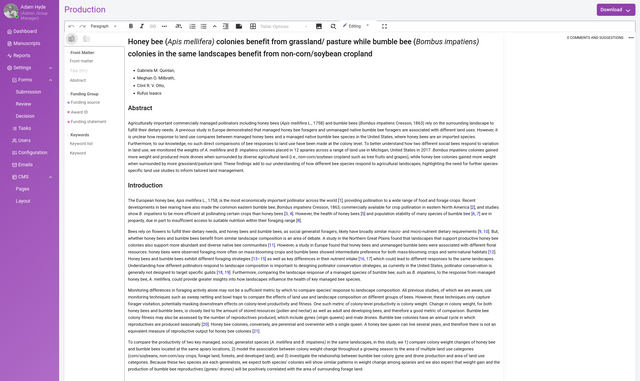
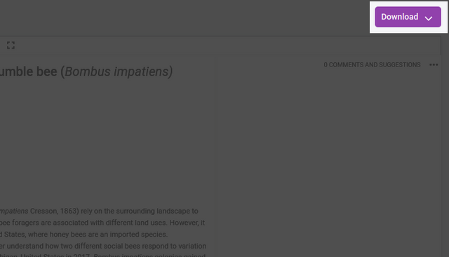

## Introduction to the Production page

The Kotahi Production interface is designed to radically reduce the cost and time for producing various formats such as HTML, PDF and JATS (XML). It can also be used for author proofing.

The interface is simple but powerful. In the production editor, you will see the manuscript displayed. This is entirely editable. On the right we see a download dropdown menu.

From this dropdown menu, you can select PDF, JATS and HTML. PDF is generated using Paged.js (see documentation). JATS is created automatically by Kotahi and validated. HTML comes straight from the content displayed in the editor.

If you wish to improve the granularity of the JATS files you produce, you can use the tools on the left menu (see JATS documentation in this manual).

You can also access the PDF (Paged.js) editor, which can be used to alter the CSS or template before exporting to PDF. Although accessed at the manuscript level, changes here will reflect all manuscripts exported as a PDF.

## Where the rest of this is documented

- [Producing a PDF](../../how-to/produce-a-pdf/) — the Paged.js templates, CSS
  and assets, and the AI Design Studio.
- [Citation tools](../../how-to/check-citations/) — reference handling.
- [Settings reference](../../reference/settings-general/) — every
  configuration option, including the Production settings tab.
