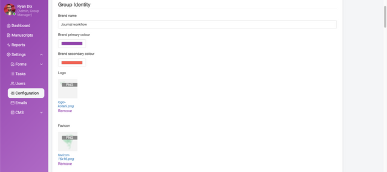

To reach these settings in Kotahi, choose **Settings → Configuration**.

## Instance type

Kotahi can be configured to meet many types of workflows and use cases (see section titled ‘Pre-configured workflows’). What is also very powerful is that Kotahi comes with some preset configurations you can choose from. We call these ‘archetypes’. Typically you cannot change this setting for a group (tenant) in Kotahi once it has been set by the administrator. However, you can create as many groups as you like, each with its own archetype. Instance types are set by a developer via the system configuration (.env) file.

It is also possible to create a workflow and save it as a template but at this moment you will need a developer to do this for you.

Instance types at the moment include:

1. **journal** - a typical Journal workflow
2. **prc** - a PRC workflow
3. **preprint1** - submit, review and publish from a single form
4. **preprint2** - submit, review and publish from a single form, and import preprints

## Group identity

Enables you to set basic branding for your group.

**Brand name** - this enables you to set the name of the group. The group name is displayed in a dropdown menu at login time for installations with multiple groups

**Title** - is the title of your publication

**Description** - a brief summary outlining the purpose of your publication

**ISSN** - is an 8-digit code used to identify newspapers, journals, magazines and periodicals of all kinds and on all media–print and electronic

**Contact** - contact details can be inserted as plain text

**Brand primary color** - used for the left hand menu, some buttons, and title texts

**Brand secondary color** - used for additional highlighting

**Logo** - the logo for the group login page

**Favicon** - icon displayed on your browser tab
