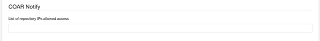
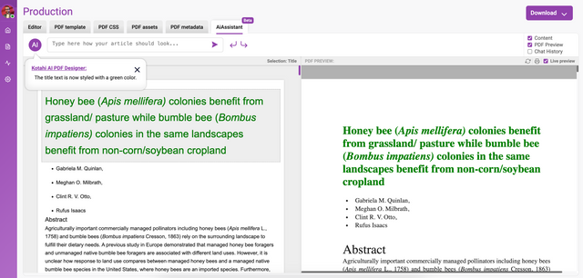

To reach these settings in Kotahi, choose **Settings → Configuration**.

### Semantic Scholar

A checkbox setting to enable/disable the import of preprints from [Semantic Scholar](https://www.semanticscholar.org/). Group Managers can select servers to import preprints/journals from. This feature is only implemented on the `prc` archetype. This is because import queries are most commonly associated with a publish, review and curate workflow, and an existing query will need to be in place to use this feature.

## Hypothesis

Settings related to some specific publishing endpoints. This may or may not be relevant to you. Essentially, if you are publishing preprint reviews to some external services the way in is via the hypothesis API.

:::note[Screenshot being refreshed]
This screen is being re-captured against the current Kotahi release. Until then, here is what it shows.

**The screen shows:** 'Publishing' section, 'Hypothesis' group, with a 'Hypothesis API key' field, a 'Hypothesis group id' field, and two unticked checkboxes: 'Apply Hypothesis tags in the submission form' and 'Reverse the order of Submission/Decision form fields published to Hypothesis'.
:::

## Crossref

API information and controls for accessing Crossref.

:::note[Screenshot being refreshed]
This screen is being re-captured against the current Kotahi release. Until then, here is what it shows.

**The screen shows:** 'Crossref' settings group listing fields for journal name, abbreviated name, home page, Crossref username, password, registrant id, depositor name and depositor email, a publication type dropdown set to 'article', DOI prefix, published article location, a CC BY 4.0 licence URL, and a ticked 'Publish to Crossref sandbox' checkbox.
:::

## Webhook

This section enables you to set a webhook for publishing to an external endpoint.

:::note[Screenshot being refreshed]
This screen is being re-captured against the current Kotahi release. Until then, here is what it shows.

**The screen shows:** 'Webhook' settings group with a 'Publishing webhook URL' pointing at a GitLab pipeline trigger endpoint, a 'Publishing webhook token' field, and 'Publishing webhook reference' set to 'main'.
:::

**Publishing webhook URL** - the endpoint or target for the publishing action supplied as a URL

**Publishing webhook token** - the secret token used to authenticate the exchange

**Publishing webhook reference** - data sent to the target to know how to process the information

## Kotahi API tokens

Input a token to access the `unreviewedPreprints` API and no other queries.

## COAR Notify

Kotahi can receive messages from [COAR's Notify service](https://www.coar-repositories.org/notify/). Authors can submit a manuscript to a 3rd party server and request a review from a group in Kotahi. Selected server IP addresses can be inserted (as comma-separated variables) and whitelisted - Kotahi can only receive requests from servers that are whitelisted.

A request results in a manuscript being imported and displayed on the Manuscripts page. Manuscripts imported via COAR Notify are identifiable by the Notify logo in the title text.

:::note[Screenshot being refreshed]
This screen is being re-captured against the current Kotahi release. Until then, here is what it shows.

**The screen shows:** Manuscripts page listing five submissions in a table of Manuscript number, Title, Created, Updated, Status, Labels and Author columns, with a red arrow pointing to a manuscript carrying an 'UNSUBMITTED' status and a green 'COAR NOTIFY' label marking it as imported via COAR Notify.
:::

## AI Design Studio

Utilize the studio to tweak page layouts, adjust image placements, manage widows and orphans, refine content with ease, or come up with completely new designs using the studio. Read more here; <https://www.robotscooking.com/redefining-document-design-unveiling-our-ai-powered-pdf-designer/>

Select an area (element) on the screen and insert a prompt into the AI chat editor and see the result! Add your OpenAI credentials on the Configuration>Integrations and Publishing Endpoints>OpenAI access key to activate the service.

