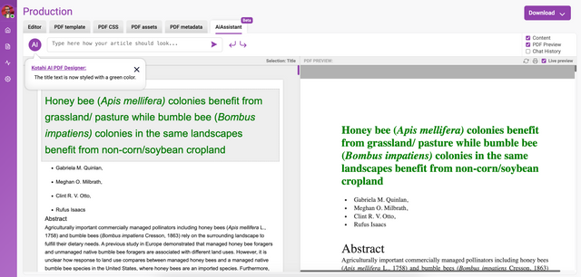

To reach these settings in Kotahi, choose **Settings → Configuration**.

## Semantic Scholar

A checkbox setting to enable or disable the import of preprints from [Semantic Scholar](https://www.semanticscholar.org/). It sits under Configuration, so only Group Admins and Admins can change it. This feature is only implemented on the `prc` instance type, because import queries are most commonly associated with a publish, review and curate workflow, and an existing query needs to be in place to use it.

## Hypothesis

Settings related to some specific publishing endpoints. This may or may not be relevant to you. Essentially, if you are publishing preprint reviews to some external services the way in is via the hypothesis API.

:::note[Screenshot being refreshed]
This screen is being re-captured against the current Kotahi release. Until then, here is what it shows.

**The screen shows:** 'Publishing' section, 'Hypothesis' group, with a 'Hypothesis API key' field, a 'Hypothesis group id' field, and two unticked checkboxes: 'Apply Hypothesis tags in the submission form' and 'Reverse the order of Submission/Decision form fields published to Hypothesis'.
:::

## Crossref

API information and controls for accessing Crossref.

:::note[Screenshot being refreshed]
This screen is being re-captured against the current Kotahi release. Until then, here is what it shows.

**The screen shows:** 'Crossref' settings group listing fields for journal name, abbreviated name, home page, Crossref username, password, registrant id, depositor name and depositor email, a publication type dropdown set to 'article', DOI prefix, published article location, a CC BY 4.0 licence URL, and a ticked 'Publish to Crossref sandbox' checkbox.
:::

## DataCite

Kotahi can deposit to **DataCite** instead of Crossref. Either way the account
and the prefix are yours: Kotahi sends the metadata, and the agency registers
the DOI.

DataCite needs fewer details than Crossref:

- **DataCite username** and **DataCite password** — your DataCite account
  credentials
- **DataCite DOI prefix** — the prefix your DOIs are registered under
- **Publish to DataCite sandbox** — a checkbox for testing against DataCite's
  sandbox rather than the live service
- **DataCite published article location** — the URL recorded for the published
  article

Crossref additionally asks for journal name and abbreviation, home page,
registrant ID, depositor name and email, publication type and a licence URL.
DataCite asks for none of those.

## Webhook

This section enables you to set a webhook for publishing to an external endpoint.

:::note[Screenshot being refreshed]
This screen is being re-captured against the current Kotahi release. Until then, here is what it shows.

**The screen shows:** 'Webhook' settings group with a 'Publishing webhook URL' pointing at a GitLab pipeline trigger endpoint, a 'Publishing webhook token' field, and 'Publishing webhook reference' set to 'main'.
:::

**Publishing webhook URL** - the endpoint or target for the publishing action supplied as a URL

**Publishing webhook token** - the secret token used to authenticate the exchange

**Publishing webhook reference** - data sent to the target to know how to process the information

## Kotahi API tokens

Input a token to access the `unreviewedPreprints` API and no other queries.

## COAR Notify

Kotahi can receive messages from [COAR's Notify service](https://www.coar-repositories.org/notify/).
A repository tells Kotahi that a manuscript is there and requests a review from
a group. The request creates a manuscript on the Manuscripts page, identifiable
by the Notify logo in the title text.

**COAR Notify auth token** — how a repository authenticates with your Kotahi.
A **Refresh** button issues a new one.

:::note[The IP allowlist is deprecated]
Earlier releases restricted access by listing repository IP addresses as a
comma-separated list in a field on this tab. The auth token replaces it.
:::

**Sciety Inbox URL** — where Kotahi sends an *Announcement: Review* when a
manuscript is published, so that the review is picked up by
[Sciety](https://sciety.org/). eLife's production instance posts to
`https://inbox-sciety-prod.elifesciences.org/inbox`. It is a Sciety-specific
field today; it may be widened to any COAR Notify inbox in future.

## Local Contexts

**Local Contexts Api Key** — credentials for
[Local Contexts](https://localcontexts.org/), which supplies Traditional
Knowledge and Biocultural Labels for Indigenous communities' material. It was
built for **iPlaces** and is in use there.

## AI Design Studio

Utilize the studio to tweak page layouts, adjust image placements, manage widows and orphans, refine content with ease, or come up with completely new designs using the studio.

Select an area (element) on the screen and insert a prompt into the AI chat editor and see the result! Add your OpenAI credentials on the Configuration>Integrations and Publishing Endpoints>OpenAI access key to activate the service.

