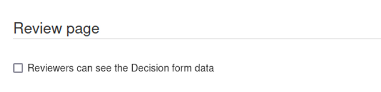
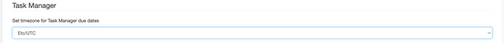
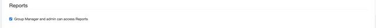
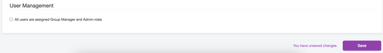

To reach these settings in Kotahi, choose **Settings → Configuration**.

### Dashboard

In Kotahi, you can change the landing page for users as the first page they arrive at after they log in.

The Landing page settings allows you to choose from either the **Dashboard** or the **Manuscripts** page as the landing page. The Dashboard is probably the most common use case but in flatter hierarchies, the entire community may wish to have access to the manuscripts page. We have found this to be the case for small groups working together or some preprint review communities.

You can additionally choose which tabs are displayed on the Dashboard. Your choice here is also reflective of your use case. If you are a Journal group, then you probably want to select all three items. If you are a community that reviews preprints that are automatically ingested, you may wish to only display the ‘To Review’ item etc

## Manuscripts page

Here you have some great options for configuring the Manuscripts page.

1. **List columns to display on the Manuscripts page** - you can configure the columns displayed on the Manuscripts page. This is actually more powerful than you might think. It is possible, for example, to create a form element in the submission form builder for the selection of workflow status from a dropdown. This can then be displayed as a column on the Manuscripts page and effectively functions as a workflow tool. There are many other possibilities and experimentation is key. Columns are added using the comma-separated internal fieldname fields for each form element added in the submission form (you can hide these elements from submission and review forms if required via the form builder controls).
2. **Number of manuscripts listed per page on the Manucripts page** - this controls the number of items displayed as a list (pagination controls).
3. **Hour when manuscripts are imported daily (UTC)** - this is a setting for the AI importing of preprint metadata. Currently set up for the AI integration requires a developer but you can use these settings to control how it works once set up.
4. **Number of days a manuscript should remain in the Manuscripts page before being automatically archived** - if you are auto-ingesting manuscripts, you might get a lot of ingested items and not be able to get through them all in the time window you desire. This option gives you the ability to auto archive those ‘expired’ items if required.
5. **Import manuscripts from Semantic Scholar no older than ‘x’ number of days** - when auto-ingesting preprints via AI you can specify the maximum age of the preprint. This helps preprint review communities discover the latest preprint materials for review.
6. **'Add new submission' action visible on the Manuscripts page** - displays the button to start a manual submission from the Manuscripts page. This is useful for many use cases, it has been used to enable preprint review communities that have automated ingestion of preprints to also add an item manually.
7. **Display action to ‘Select’ manuscripts for review from the Manuscripts page -** ‘Select’ is a triaging feature, especially useful in conjunction with bulk imports. It changes the 'label' field to ‘Ready to evaluate’. Filtering and bulk deletion can be used in conjunction with these labels. It is also used for feeding AI selection criteria in some use cases.
8. **Import manuscripts manually using the 'Refresh' action** - this will put a ‘Refresh’ button on the Manuscripts page so you can manually start the auto ingestion process.

## Control panel

This setting group enables you to configure various items on the Control page.

1. **Display manuscript short ID** - each research object has a unique ID given to it by Kotahi. This is an ‘internal’ identifier largely just used so users can discuss or find the item easily. Checking this item will display the relevant manuscript ID on the Control Panel for each research object.
2. **Reviewers can see submitted reviews** - set if you wish reviewers to see each others’ reviews. If not checked, reviewers can see only their own review.
3. **Authors can see individual peer reviews** - if checked, authors can see the entire review for each reviewer.
4. **Allow authors to participate in proofreading rounds -** if checked, editors will be able to assign authors to a round of proofing.
5. **Editors can edit submitted reviews -** if checked, editors can edit submitted reviews from the Control panel>Reviews page.
6. **Control pages visible to editors** - you can hide various tabs if they are not relevant to your use case.

## Submission

There is one item - **Allow an author to submit a new version of their manuscript at any time**. This setting determines if an author/submitter needs to wait until the beginning of a new review round to submit a new version of their manuscript and metadata, or alternatively, if checked, the author can submit at any time (even mid-review). This has been used by preprint review communities where the review process (Kotahi) and submission system (a preprint server) are decoupled.

## Review page

This setting determines whether Reviewers can see the decision/evaluation information.

## Task manager

Here you can set the timezone for the date picker when setting tasks.

## Reports

Settings to show or hide the reports page from the menu.

## User management

One interesting user setting and a misplaced API key setting

**All users are assigned Group Manager and Admin roles** - essentially gives you a flat community hierarchy in which all users can access all pages in the menu and see all parts of the process.
