### In this section

- An Indepth Look At All Features
- Tasks
- Notifications
- MetaData
- Manuscript Editing
- Decision Controls

Every research object has its own Control page. This is used by the team to manage the review and publishing process.

:::caution[Screenshot withheld pending re-capture]
A screenshot belongs here, but the archived capture contains personal data (names, email addresses or ORCID identifiers) belonging to real people and has not been published.

**What it showed:** Control page for a manuscript with tabs Team, Decision, Reviews, Manuscript text, Metadata and 'Tasks & Notifications'. The Team tab shows three 'Assign editor' dropdowns and a Reviewer Status board with Invited, Accepted, In Progress and Completed columns, plus 'Discussion with author' and 'Editorial discussion' chat panels on the right.

*Action needed: re-capture this screen using test data.*
:::

There are 6 tabs:

1. **Team** - the team (editors and reviewers) is managed here
2. **Decision** - this is where the management of the decision/evaluation takes place
3. **Reviews** - where are submitted reviews are displayed
4. **Manuscript text** - the full text (if applicable) of the research object
5. **Metadata** - the full list of metadata associated with the research object
6. **Task and notifications** - where tasks are managed for this specific research object and where manual notifications can be actioned

Additionally, at the top of the page is the version dropdown. This dropdown persists across all tab views.

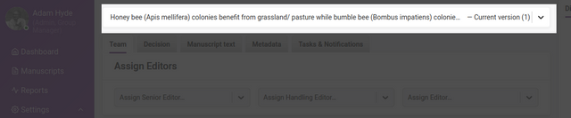

The version dropdown displays the name of the research object AND the version or ‘round’ you are currently in. Research objects can be reviewed in multiple rounds, and in each round Kotahi creates a new ‘version’ (of all data) of the submission. The latest version is always displayed when you visit the control page, but you can browse earlier versions from the dropdown.

In addition, there are two chat rooms to the right of the page which are also persistent across all tabs.

The **Discussion with Author** is for the team to use to chat with the author (if applicable) that submitted the research object.

The **Editorial discussion** is for the team to use to chat with each other about the research object. Reviewers also have access to this channel. A video link is also available for a group chat if required;

:::caution[Screenshot withheld pending re-capture]
A screenshot belongs here, but the archived capture contains personal data (names, email addresses or ORCID identifiers) belonging to real people and has not been published.

**What it showed:** 'Editorial discussion' tab of the Control page chat with a video-call button and a dated system entry recording that a reviewer invitation was sent, above the message field and 'Send' button.

*Action needed: re-capture this screen using test data.*
:::

## Team tab

The team tab enables assigning of the editorial team and invite reviewers.

**To assign Editors,** simply choose the person from each of the dropdown menus for Senior Editor, Handling Editor, and an additional Editor.

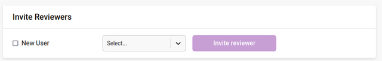

In the case of preprint review communities or other workflows, these roles are best considered as as team members, each with the same level of privileges for managing the process around the research object.

**To invite reviewers,** simply select a user from the dropdown menu (listing all users in Kotahi). Note: typing the first letters of the preferred reviewer will trigger the autocomplete function. If the user does not exist in the system, you can invite someone via email by clicking the ‘New user’ option:

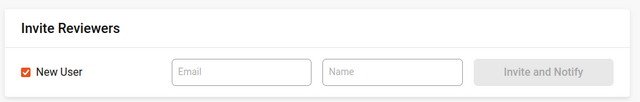

Here you can enter the name and the email of the reviewer you wish to invite. They will also receive an email invitation and if they click accept from the email, their account will be created and the review will be associated with their new account.

If the **author proofing workflow** is enabled (see the Configuration page), editors can invite an author to participate in a round of proofing by clicking on 'Submit for author proofing’. This will notify the author using the ‘Author proofing invitation’ email notification.

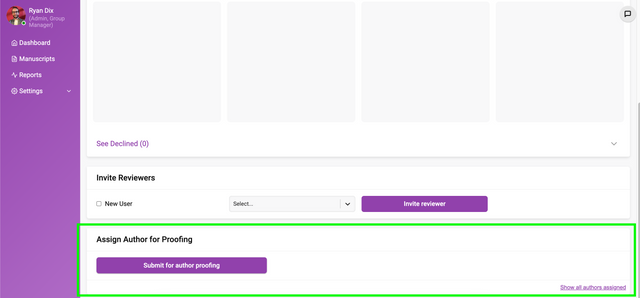

The author will be able to access the Production editor from a link included in the email notification or from a link provided on the Dashboard.

The manuscript status will be updated following the phase;

1. The editor assigns the author from the Control panel, and the status updates to; 'Author proof assigned'
2. Author access the Author proofing editor (clicks on the Dashboard→My Submissions→Production editor link) and the status updates to; ‘Author proofing in progress’
3. Author submits proofing feedback (clicks on the submit action on the Production editor>Feedback page) and the status updates to; ‘Author proof completed’

The author can add ‘Suggested’ changes to a manuscript (if a docx submission) and complete a ‘Feedback’ form.

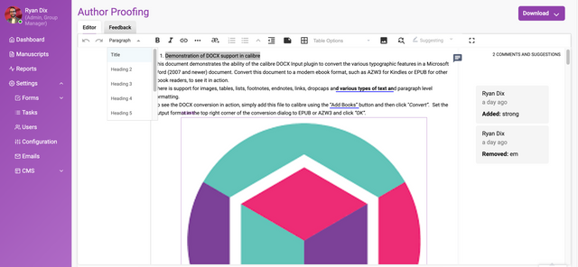

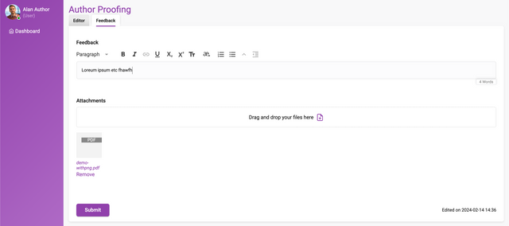

On the successful submission of a Feedback form, the editor (Editor role) assigned will receive an ‘Author proofing submitted’ notification. A link to the production editor and Feedback form will be included in the email notification. The editor can also access the author's feedback from the Control panel→Feedback page and suggested changes or comments from the Manuscripts text page.

An overview of steps that constitute a round of author proofing;

1. Editor assigns an author to a round of proofing from the Control panel→Teams page
2. Author receives an email notification with a link to the feedback form / alternatively the author can access the feedback form a link on their Dashboard→My submissions
3. Author is able to add Comments and 'Suggested’ (track changes) in the Production editor and can also submit a feedback form
4. Editor receives an email notification that author feedback has been submitted
5. Editor can access the feedback from the control panel (read-only)

A history of author feedback is captured in the feedback form. A record of authors assigned to participate in a round of proofing is captured in the Control panel→Teams page per version.

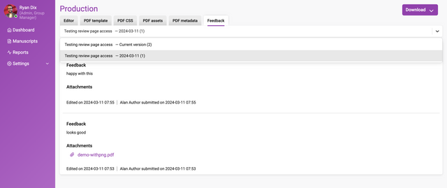

## Review status

It is possible to see the status of all reviews at a glance:

:::caution[Screenshot withheld pending re-capture]
A screenshot belongs here, but the archived capture contains personal data (names, email addresses or ORCID identifiers) belonging to real people and has not been published.

**What it showed:** 'Reviewer Status' panel labelled 'Version 1', with four columns of coloured status headings — 'Invited', 'Accepted', 'In Progress' and 'Completed'. A single reviewer card sits in 'In Progress' showing a reviewer name and 'Last updated today', with a 'See Declined (0)' link below.

*Action needed: re-capture this screen using test data.*
:::

**Invited** - existing/new users have been assigned as a reviewer. This can be done manually or by sending a ‘Reviewer invitation’ email notification.

**Accepted** - the reviewer has accepted the review from the ‘Accept’ action displayed on the Dashboard→To Review page or embedded within the email notification.

**In progress** - the reviewers have accessed the Review page.

**Completed** - the reviewers have submitted a review. A review submission is uneditable.

In the Reviewer Status window (shown above) you will notice ‘Version 1’ in the top right corner. This is the version or ‘round’ number (see above).

As reviewers are invited and progress through the workflow, the reviewer icons will automatically progress through the flow from left to right.

Clicking on a reviewer card will display a pop-up with further information:

:::caution[Screenshot withheld pending re-capture]
A screenshot belongs here, but the archived capture contains personal data (names, email addresses or ORCID identifiers) belonging to real people and has not been published.

**What it showed:** Reviewer report pop-up over the greyed-out 'Reviewer Status' board, headed with the reviewer's name and a last-updated timestamp. It shows the reviewer's avatar, name and ORCID, 'Status: IN PROGRESS', the message "Review hasn't been completed yet", a 'Shared' checkbox and a 'Delete' button.

*Action needed: re-capture this screen using test data.*
:::

If the review is completed, this pop-up will display the actual review. Additional controls allow the editor to **‘Share’** the review - this enables submitted reviews to be visible to other reviewers who have submitted a review and have the ‘Shared’ enabled. **‘Hide review’** will hide the review from the Author when a Decision is submitted, and **‘Hide reviewer name’** will anonymise the review on the Review page.

:::caution[Screenshot withheld pending re-capture]
A screenshot belongs here, but the archived capture contains personal data (names, email addresses or ORCID identifiers) belonging to real people and has not been published.

**What it showed:** Review report pop-up opened over the Control page Team tab, showing the reviewer's name and ORCID, 'Status: COMPLETED', 'Recommendation: REJECT', and sections for comments to the author, confidential comments to the editor, and supplementary files. Along the bottom are 'Hide Review', 'Hide Reviewer Name', a ticked 'Shared' checkbox and 'Delete'.

*Action needed: re-capture this screen using test data.*
:::

Clicking ‘See Declined’ at the bottom of this area will display all declined invitations. Reviewers who decline an invitation to review are directed to a landing page where feedback on the decision can be captured, and the user can also choose to ‘Opt out of further requests’ to participate in a peer review.

## Decision tab

The **Decision tab** displays all the information and controls necessary to determine the outcome for the current review round.

:::caution[Screenshot withheld pending re-capture]
A screenshot belongs here, but the archived capture contains personal data (names, email addresses or ORCID identifiers) belonging to real people and has not been published.

**What it showed:** Control page 'Decision' tab. 'Completed Reviews' lists an accepted reviewer invitation and 'Review 1' with the reviewer's name and ORCID, ticked 'Hide review' and 'Hide reviewer name' checkboxes and a 'Show' link. Below, the configurable Decision form offers 'Threaded Discussion' and 'Decision' rich-text editors with a 'Publish' checkbox and a drag-and-drop file area, with an 'Editorial discussion' panel open on the right.

*Action needed: re-capture this screen using test data.*
:::

As with many things in Kotahi, the Decision form is entirely configurable (see section on Decision form), so the form you see is displayed on the Decision tab.

**Completed Reviews** are displayed at the top of the tab for ease of reference when compiling evaluation/decision summaries. Clicking on ‘Show’ for each completed review will display the actual review.

Below the decision form are two buttons - **Submit** and **Publish**.

The ‘Submit’ button sends the decision and associated information to the submitting author. If the decision was ‘accept’ then the ‘Publish’ button will change to an active state. Clicking on ‘Publish’ will publish the research object. Publishing itself is entirely configurable so what happens at this moment will depend on how your Kotahi group is configured.

## Reviews tab

The reviews tab displays all submitted reviews. Reviews still in progress will not be displayed on the Reviews page.

:::caution[Screenshot withheld pending re-capture]
A screenshot belongs here, but the archived capture contains personal data (names, email addresses or ORCID identifiers) belonging to real people and has not been published.

**What it showed:** Control page 'Reviews' tab listing 'Completed Reviews' as Review 1, Review 2 and Review 3. Each row shows the reviewer's name and ORCID alongside 'Hide review' and 'Hide reviewer name' checkboxes and a 'Show' link; Review 1 has 'Hide reviewer name' ticked.

*Action needed: re-capture this screen using test data.*
:::

The following settings can be enabled per review;

**Hide review** - when enabled, this will hide the review feedback from the author and/or reviewers when clicking and/or ‘Submit’ and/or ‘Publish’ action from the Control panel>Decision tab.

**Hide reviewer name** - when enabled, a reviewers username will be anonymised when shared with the author and/or other reviewers or when published to an endpoint. If the ‘Hide review’ setting is unselected and the ‘Hide reviewer name’ is enabled, the reviewer username will appear as ‘Anonymous’ when shared/published.

## Manuscript text tab

The manuscript text tab displays the entire manuscript (if submitted as a docx) in the Kotahi scholarly word processor.

Comments can be made in the editor. For a full rundown of how the editor works, please see the section on the *Kotahi Scholarly Word Processor*.v

## Metadata tab

All metadata added to the research object will be displayed here.

What is displayed on this screen depends entirely on how the metadata submission form has been configured. For example, Submission form fields that are hidden from the Author are accessible to the editorial team from this tab.

## Tasks & Notifications tab

This page displays the tasks and notification controls for the research object.

### Notifications

The **Notifications** controls allow you to send email notifications to registered users or to new users. To send a notification to a registered user simply select their name and the notification from the dropdowns and press ‘Notify’.

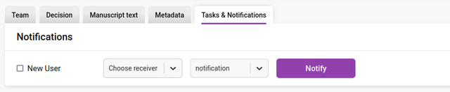

To send a notification to a new user (unregistered user) simply click on the ‘New User’ box, enter their email address and name, choose the notification and press ‘Notify’.

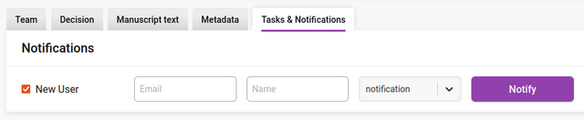

When the notification has been successfully sent, a check appears next to ‘Notify’ on the button, and you will also the action event recorded in the **Editorial discussion** chat.

:::caution[Screenshot withheld pending re-capture]
A screenshot belongs here, but the archived capture contains personal data (names, email addresses or ORCID identifiers) belonging to real people and has not been published.

**What it showed:** Notifications row after a successful send: a registered recipient is selected, the type is 'Task notification', and the 'Notify' button now shows a tick. The 'Editorial discussion' panel on the right logs the reviewer invitation and the task notification with timestamps.

*Action needed: re-capture this screen using test data.*
:::

### Tasks

The **Tasks** section displays all tasks for the research object.

The initial task list for the research object will be inherited from the task list set up in
 Settings →Tasks (see that section). It is also possible to add/delete/alter the inherited list to suit the needs of the specific research object.

Tasks can be created, edited, deleted, modified, started, and reordered from this interface.

**Adding tasks** is done via the ‘+’ button at the bottom of the task list.

**Starting a task** can be actioned by clicking on the ‘Start’ button. Starting a task will change the status of the task to ‘In progress’. Associated email notifications will only be sent on the due date if the task is ‘In progress’.

**Pausing a task** can be done by selecting the ‘Pause’ status in the dropdown menu. This will also suppress email notifications that are queued to be sent.

You can **mark a task as complete** by clicking on the left circular ‘Done’ checkbox or selecting the status of done from the dropdown menu.

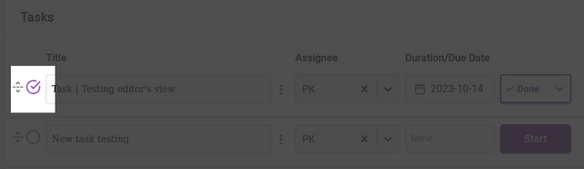

**Adding a task** title and **adding an assignee** can all be done via the input fields provided. The assignee dropdown displays a list of roles and the full searchable list of users in the system for selection.

A **description** can be added to each task. Use this field to be specific about task requirements, and use editing tools to add lists, links and other details as needed.

**Duration** can only be edited by opening the task for editing.

**Deletion or editing** of the tasks can be managed through the icon displayed between the task title and the assignee.

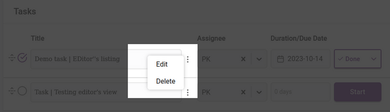

**Deletion** will ask you for a confirmation before completing.

When editing a task the overlay for that task will appear.

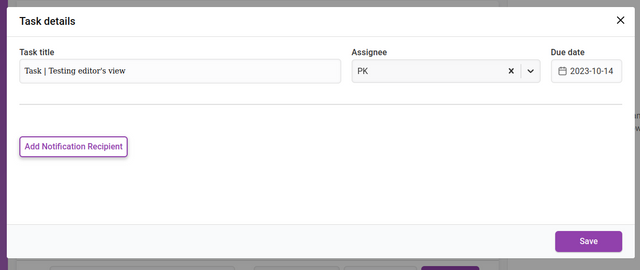

**Duration** can be changed from the ‘Due date’ item on the left. When clicked it will display a date picker.

Clicking ‘Add Notification Recipient’ will display an interface for adding new recipients of notifications. You can add as many recipients as you like. These notifications are triggered according to the de date set.

The input fields require a chosen recipient from the Recipient dropdown list. You can also add a recipient that is not registered in Kotahi by choosing ‘Unregistered user’ from the dropdown. This selection will display additional fields for the email address and name of the recipient.

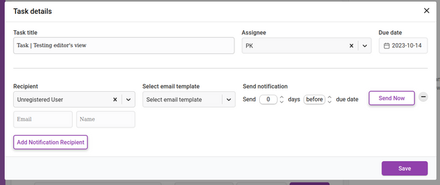

You then set when the notification is sent out. The notification can be sent at a time of your choosing (including **Send Now**) relative to the due date of the task. The **Send notification** fields allow you to choose a time before or after the due date by the number of days you require.

A record of email notifications sent manually or automatically are captured in a dropdown list, in descending order based on the date and time sent. System emails are sent by ‘Kotahi’ and notifications sent manually use the username as sender id e.g. ‘Ryan Dix’.

:::caution[Screenshot withheld pending re-capture]
A screenshot belongs here, but the archived capture contains personal data (names, email addresses or ORCID identifiers) belonging to real people and has not been published.

**What it showed:** 'Task details' overlay listing two notification recipients with the email templates 'Reviewer Invitation' and 'Task notification'; an arrow points to the expanded 'Hide all notifications sent (3)' log of dated, timestamped sent emails.

*Action needed: re-capture this screen using test data.*
:::

If an email notification cannot be sent due to a configuration error, then a warning icon will be displayed on the ‘Send Now’ button.

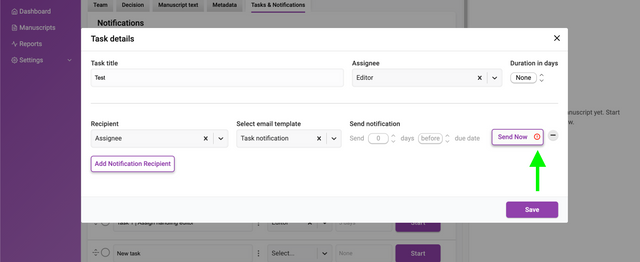
