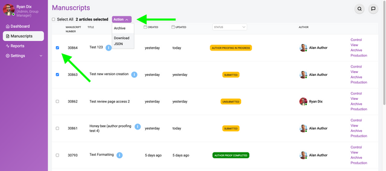

### In this section

- An Indepth Look At All Features
- Automated Ingestions
- Chat Functionality

The Manuscripts page is generally only available to Kotahi **Group Manager** and **Editor** roles.

:::caution[Screenshot withheld pending re-capture]
A screenshot belongs here, but the archived capture contains personal data (names, email addresses or ORCID identifiers) belonging to real people and has not been published.

**What it showed:** Manuscripts page in a journal configuration, listing research objects by Manuscript Number, Title, Created, Updated, Status badge, Author, and per-row links 'Control', 'View', 'Archive' and 'Production'.

*Action needed: re-capture this screen using test data.*
:::

The Manuscripts page is entirely configurable, so the actual columns you may see in your version might be quite different to the example above (taken from a journal configuration of Kotahi).

:::caution[Screenshot withheld pending re-capture]
A screenshot belongs here, but the archived capture contains personal data (names, email addresses or ORCID identifiers) belonging to real people and has not been published.

**What it showed:** Manuscripts page configured for a preprint review workflow, with a 'Refresh' button, 'Select All', an 'Archive' action, and columns for Created, Updated, Status, Labels such as 'READY TO EVALUATE' and 'EVALUATED', and Author.

*Action needed: re-capture this screen using test data.*
:::

The Manuscripts page displays all research objects in the system. The above image shows a very different Manuscripts page configured for a preprint review workflow. You can choose which field you wish to display from the Configuration>Workflow page.

All columns are sortable, one click sorts a column in ascending order (0→9, a→z), a second click sorts in descending order (9→0, z→a).

## **Status**

Filter by manuscript status;

**Unsubmitted -** the submission form has not been submitted by the author.

**Submitted -** the submission form has been successfully submitted.

**Accepted -** a manuscript ‘Accept’ decision has been submitted by an editor.

This status is only applicable when using the special form field type ‘Verdict’. This field is used as a default Decision form field when using the instance type.

**Rejected -** a manuscript ‘Reject’ decision has been submitted by an editor.

This status is only applicable when using the special form field type ‘Verdict’. This field is used as a default Decision form field when using the instance type.

**Revise -** a manuscript ‘Revise’ decision has been submitted by an editor. This will allow an author to submit a new version of the manuscript.

This status is only applicable when using the special form field type ‘Verdict’. This field is used as a default Decision form field when using the instance type.

**Revising -** an author has created a new version and in the process of editing the submission.

**Published -** an editor has published an article to an endpoint.

**Author proofing assigned -** author assigned to a round of author proofing (‘Author proofing invitation’ email notification has been sent to the author).

**Author proofing in progress -** the author has accessed the production editor and suggested changes and/or edited the submission form.

**Author proof completed -** an author has submitted the author proofing feedback form (‘Author proofing submitted’ email notification has been sent to the editor).

You can select or bulk select manuscripts from the Manuscripts page. Once you have made a selection you have the option to ‘Archive’ or ‘Download as JSON’.

- **Archive** - will delete the object from the Manuscripts table, but not the database. Currently, archived manuscripts can not be retrieved from a frontend interface.
- **Download as JSON** - will automatically download a single or multiple files to your downloads folder. All manuscript metadata is included in the JSON file.

## Automated ingestion of submissions

Kotahi can be configured to import manuscripts automatically from the Settings→Configuration→Manuscripts page. If the Manuscripts page displays a refresh button as below, this is for the automated batch ingestion of submissions. Generally, this is used for the ingestion of preprints from various sources but the functionality could be used for batch ingestion of other types of material.

:::caution[Screenshot withheld pending re-capture]
A screenshot belongs here, but the archived capture contains personal data (names, email addresses or ORCID identifiers) belonging to real people and has not been published.

**What it showed:** Close-up of the Manuscripts page header with the 'Refresh' button spotlighted next to the search and chat icons; this button triggers automated batch ingestion of submissions.

*Action needed: re-capture this screen using test data.*
:::

In most use cases, this button is used for ingesting preprints from various sources using its AI-powered engine. If the ‘Refresh’ button is available, pressing it will trigger this automated process. The system can also be configured to ingest preprints on a regular schedule without needing the button to be pressed. This automated ingestion helps keep your preprint collection up-to-date efficiently.

## Discussions

There is a live discussion (chat) available for all members who have access to the Manuscripts page.

:::caution[Screenshot withheld pending re-capture]
A screenshot belongs here, but the archived capture contains personal data (names, email addresses or ORCID identifiers) belonging to real people and has not been published.

**What it showed:** 'Group Manager discussion' chat panel opened beside the Manuscripts list, with date-separated messages, timestamps, a video-camera icon, a 'Hide Chat' button and a message field with 'Send'.

*Action needed: re-capture this screen using test data.*
:::

The chat also two very powerful features - rich text (including math) and @mentions. In addition, video chat is available. Clicking on the camera icon displayed will open a video chat room.

### Rich Text

Clicking on the small icon to the left of the ‘Your message here...’ input field will display a rich text editor toolbar:

This enables rich text to be created or edited if the content is cut and pasted into the chat input area. Math is also supported using the $$ syntax.

### @Mentions

Typing ‘@’ into the chat input area will display a pop-up of users that can access the chat.

:::caution[Screenshot withheld pending re-capture]
A screenshot belongs here, but the archived capture contains personal data (names, email addresses or ORCID identifiers) belonging to real people and has not been published.

**What it showed:** Typing '@' in the chat input opens a pop-up list of five selectable users with access to the chat, shown above the message field and 'Send' button; choosing a name emails that person a notification.

*Action needed: re-capture this screen using test data.*
:::

Selecting the name of the person you wish to notify will send them an email notification.

Hovering your mouse over a message reveals an ellipses menu which contains actions to edit/delete a post. You can also mute (press) email notification communication per channel from the ellipses menu at the top of the chat viewport.
