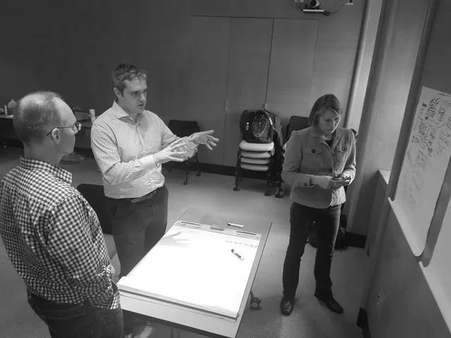
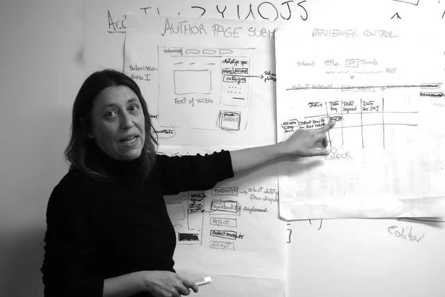
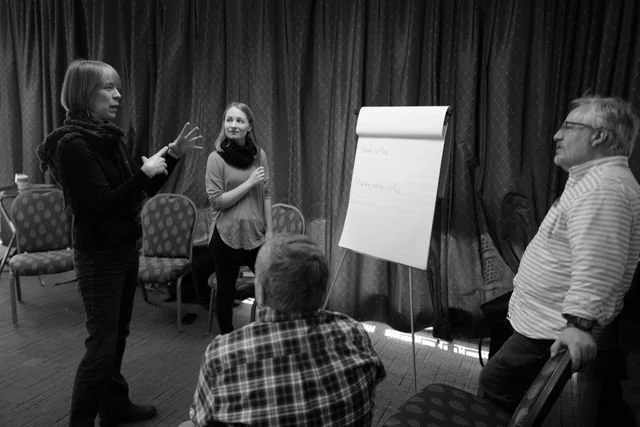
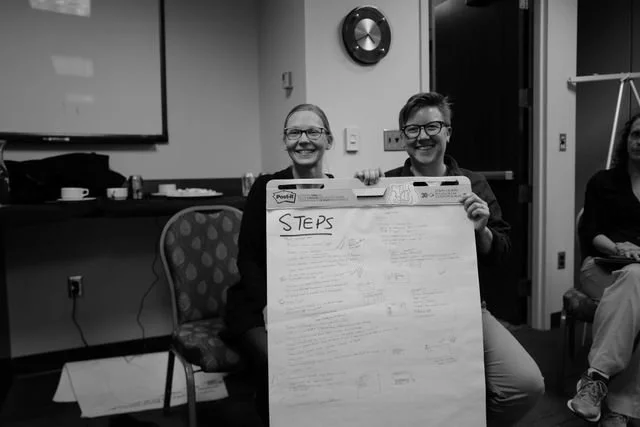
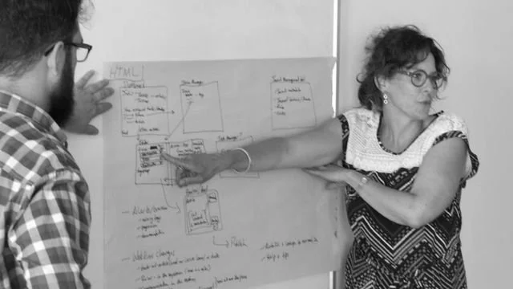
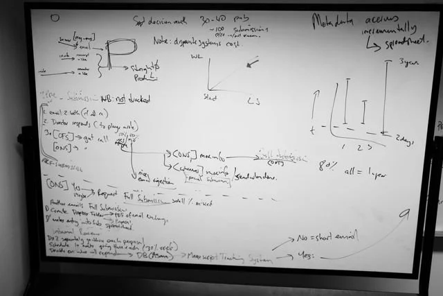
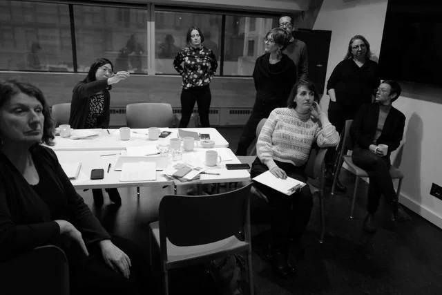
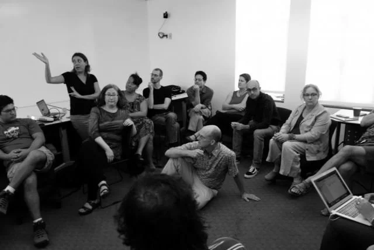
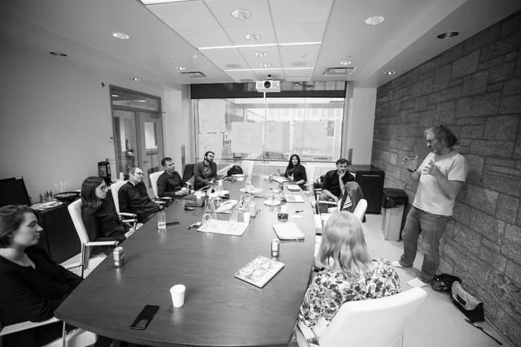

*Workflow Sprints are fun and fast.*

A Workflow Sprint is a fast and efficient methodology for organisations to understand and optimise their publishing workflows before making technology choices.

A Workflow Sprint is a fast and efficient methodology for organisations to understand and optimise their publishing workflows before making technology choices.

This process was designed after observing some common mistakes:

- investing in slow and costly general requirements research
- looking at workflows mainly through a technology lens

Understanding and improving workflows need not be lengthy or expensive. Traditional processes like interviewing staff and producing large narrative reports are slow, expensive and often lack clarity.

In contrast, Workflow Sprints produce clear outputs in days, not months. The Sprint first investigates current workflows and then defines optimised ones. With these results, organisations can make informed technology decisions.

Coko designed this process. eLife Pathways now facilitates Workflow Sprints, and the method is documented here in case you would like to run one yourself.

## Principles of Workflow Sprints

There are some fundamental principles of Workflow Sprints:

### Principle 1: Invite operational stakeholders

The best people for describing an existing (or speculative) workflow and optimising that workflow are the people actually doing the work now - your team (operational stakeholders).

### Principle 2: Group discussion is essential

Group discussion involving the operational stakeholders is the most effective way to understand and optimise workflow. Having these experts in the same room eliminates guesswork and team members can drill down into an issue together in quick time to tease out the fidelity needed.

### Principle 3: Facilitation is key

Experienced facilitation conducted by someone external to your organisation is critical for keeping the momentum going and managing any potential and problematic team dynamics.

### **Principle 4: Keep the documentation light**

If the documentation of the workflow is not something decision makers can easily grasp, then you are doing it wrong. Use Workflow MarkUp (WFMU - see documentation) to aid in expediting the documentation process while producing clear, human-readable documents.

Now that we have the principles covered, let’s take a brief look at what a Workflow Sprint actually looks like.

### What does a Workflow Sprint look like?

Photos included below are from actual Workflow Sprints (arXiv, Open Education Network, Ravenspace, Érudit, Organisation for Human Brain Mapping, Wormbase/Micropublications.org).

A Workflow Sprint is a facilitated, structured conversation between the organisation’s primary stakeholders. The stakeholder group should comprise those people that are part of the current workflow (constituting all parts of the workflow) and decision makers.

Operational stakeholders are the people who do the work. These are the most important people to have involved because they are the ones that understand what is done, on the floor, at this time. Sometimes, if automation is involved, a trusted technician that knows the limits and possibilities of publishing technology might be useful. No Workflow Sprint can occur without operational stakeholders.

Strategic stakeholders are the organisation’s decision makers. The decision makers may, or may not be part of the process, however, they will certainly utilise the outcomes to guide them in making decisions going forward. It can be a good idea to include strategic stakeholders to build internal buy-in.

The Workflow Sprint draws these two types of stakeholders together in a series of remote or realspace sessions. If held in realspace the event can occur over one day. For remote events (which we have found to be more fatiguing), the Sprint should be broken down into multiple shorter sessions over several days.

The facilitator guides the group through a process designed specifically for your organisation. The steps usually include (discussed in more detail below):

1. Introductions
2. High-level description of the goal
3. High-level discussion
4. Documentation of the existing workflow
5. Open discussion
6. Designing an optimal workflow
7. Report (optional)

Each phase of the above process should be fun and characterised by a high level of engagement from the team.

Simple tools such as whiteboards (or ‘virtual whiteboards’ if remote), large sheets of paper, and markers are often used to draw out existing workflow processes or future workflow ideas.

Workflow Sprints are fun, efficient, cost-effective, and fast. The process is a good way to generate additional internal buy-in for a project and to quickly help everyone understand the broader goals and challenges.

We have found that Workflow Sprints are also extremely effective team-building events. If held in realspace, we advocate good food and coffee! If done remotely, we sometimes include some less formal moments to help people relax and get into the flow of the event.

Now let’s look at the process in more detail. The following is not comprehensive, but it should give you a good starting point. If you want to drill down further into the process, feel free to contact me.

### Speculative vs extractive Workflow Sprints

Before we get started, a quick word about two types of Workflow Sprints already hinted at throughout this document. The two types are:

**Speculative** - Speculative Workflow Sprints imagine new workflows. Typically new entrants or start ups require speculative Sprints. Inevitably the speculative variety can reveal a lot of contradictory requirements and ‘blurry vision’ that need to be discussed and examined in detail. Sometimes, the outcomes may also lead to compromises the stakeholders may find difficult to accept. Consequently, Speculative Workflow Sprints often take longer and require a higher degree of expert facilitation.

**Extractive** - Extractive Workflow Sprints start by examining a known (existing) workflow. Generally speaking, these descriptive processes are easier to facilitate and quicker to document.

### Realspace vs Remote

A word regarding remote vs realspace events. In-person Sprint processes are definitely more effective and quicker. Remote Sprints are possible, however, the dynamics and format change somewhat. Documentation for remote events is usually done with shared virtual whiteboards, and the process is usually split into several shorter events spread over a number of days.

Hybrid Workflow Sprints (a mix of virtual and in-person participants) are also possible but are harder still, mainly due to the fact that the tools used for documentation are necessarily different, which makes it harder to share ideas across a team split between real and virtual spaces.

### The team

When hosting a Workflow Sprint, the first question you need to answer is - who do I invite? There is a simple rule - invite enough operational stakeholders to have every part of the workflow covered. Having strategic stakeholders may be (not always) a good idea, but do keep in mind the more people involved that don’t do the work ‘on the floor’ the longer the process will take. Having said that, strategic stakeholders stand to learn a lot during the process if they participate.

In the case of ‘speculative’ (new) workflows, you need to gather the people with the vision and some folks that know about the kind of work you have in mind.

### The space

If the Sprint is held in realspace, it is good to have a single table that can seat everyone involved. In addition, break-out spaces with enough whiteboards or paper and markers to go around are necessary. Post-it notes are welcome but not required.

### Facilitation

It is very important to have a neutral facilitator. The facilitator needs to ask hard, bothersome questions, and consequently it is much easier to do this if the facilitator is not subject to internal power dynamics and existing interpersonal relationships. In addition, the facilitator must:

1. **Facilitate conversations** - the facilitator must hold the space for the group to come together and share their knowledge and ideas.
2. **Manage the process** - the facilitator must keep the process moving forward.
3. **Balance group dynamics** - the facilitator constantly reads the group, pre-empting obstacles to collaboration and productivity and adapting the strategy accordingly.

Facilitation is a deep art and there is way too much to go into here (yet another thesis…). However we strongly advise hiring (us!) an experienced facilitator from outside your organisation.

### The steps

As mentioned above, the process generally follows a similar pattern but should be adapted before or during the event if necessary:

#### Introductions

Quick introductions of everyone in the room.

#### High-level description of the goal

The facilitator outlines what the group is trying to achieve and, in quick detail, describes the Workflow Sprint process. A strategic stakeholder may be introduced to give a 5-minute validation of why the group is gathered.

#### High-level discussion

It is always necessary to start with a very high-level discussion about the workflow and what the group is trying to achieve together. In general, the Workflow Sprint process starts with a very wide (sometimes meandering) conversation and very quickly begins to focus on specifics.

#### Documentation of the existing workflow

If the group is large, the facilitator may break it down into smaller groups to drill down into specific parts of the workflow. Each group will then present their documentation back to the larger group. At the completion of this process, workflow should be documented in its entirety in front of the entire group (using whiteboards or large pieces of paper or shared virtual whiteboards if working remotely). Documenting with everyone present helps validate the workflow and ensures any vagueness or ‘gotchas’ are caught.

#### Open Discussion

A general discussion on what people think about the existing workflow. It is good to allow this to slip into a little brainstorming in anticipation of the next step.

#### Designing an optimal workflow

The facilitator generally breaks the team into smaller groups. Each group chooses some part of the workflow (or the entire workflow) they wish to re-imagine. Documentation is often captured with drawings (there is no preferred format - let each group decide). Each smaller group’s work is presented back to the entire group and discussed. From this, the facilitator can document (also in front of the entire team) a proposed optimised workflow.

#### Report

Generally, the facilitator will take all the documentation and distill it into a short report. Documentation of the outcomes usually uses workflow notation (see below) as well as pictures of all the artifacts created during the event. The facilitator generally adds further information to tease out some questions for the organisation to consider (contradictions/compromises etc).

### What are the outcomes of a Workflow Sprint?

There are two direct outcomes of a Workflow Sprint:

1. Documentation of the existing workflow - a description of your workflow as it exists now.
2. Documentation of the optimised workflow - a description of the ideal, optimised, workflow.

In addition, depending on how much your facilitator understands about publishing, they may wish to generate a third outcome: a report - a report with the above two items plus narrative about the realities of achieving the optimised workflow and any other issues that may need to be considered.

From this report, the organisation should be in a very good position to consider technology options. A publisher can now do a gap analysis to evaluate existing solutions or start the design process to build new technology.

#### Some photos from workflow sprints…

